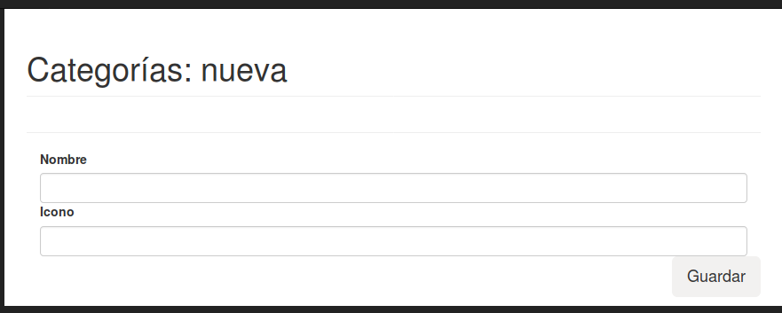
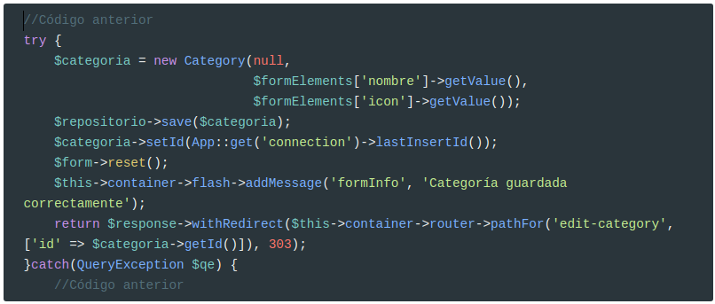
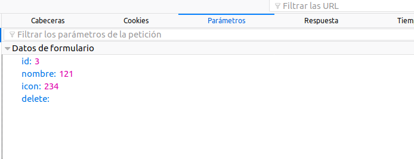
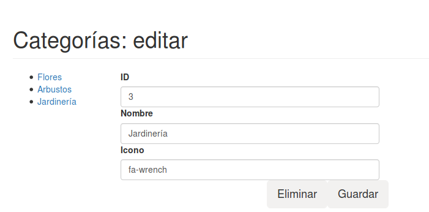
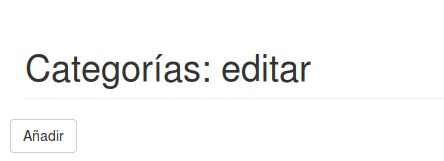
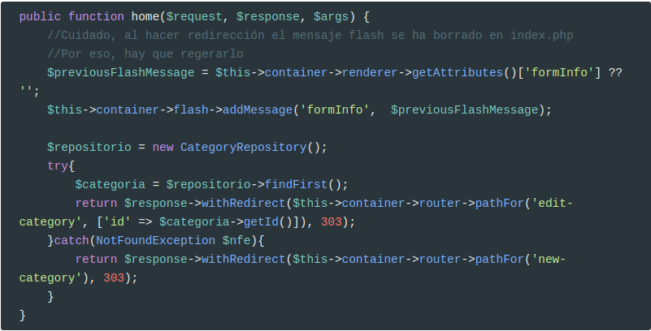

# Categorías

Vamos a realizar un mantenimiento de la tabla `categorias`, que nos permita realizar operaciones [CRUD](https://es.wikipedia.org/wiki/CRUD) (**C**reate, **R**ead, **U**pdate, **D**elete).

## Create




El primer paso es crear la entidad `Category` y el repositorio `CategoryRepository`.

Ahora ya podemos empezar con el controlador. Pero antes de empezar vamos a cambiar el método `home`

```php
public function home($request, $response, $args) {
    $pageheader = "Categorías";
    return $response->write($pageheader);
    //return $this->container->renderer->render($response, "categorias.view.php", compact('pageheader'));
}
```

Porque vamos a ir haciendo cambios en la vista `categorias.view.php` y no quiero modificar este método hasta que estén hechos el resto de controladores (ya veréis por qué)

A continuación creamos la nueva ruta en el controlador frontal  `public/admin/index.php`

```php
$app->map(['GET', 'POST'], '/categorias/new', CategoryController::class . ':add')
    ->setName('categoria-nueva');
```

Y creamos el método `add` en `CategoryController`:
<script src="https://gist.github.com/victorponz/deb2515be350760457c73db54d045253.js"></script>

### **Novedades**

**Mensajes Flash**

En este método vamos a ver el uso de mensajes Flash en la línea **34** (esos que una vez se leen se auto-destruyen)

Para usar mensajes Flash hemos de instalar este componente:


```bash
composer require slim/flash
```

Y ahora configurarlo en el controlador frontal:

```php
<?php
//...
use \Slim\Flash\Messages;

//...
$container['flash'] = function () {
    return new Messages();
};

$templateVariables = [
    "basePath" =>  $container->request->getUri()->getBasePath(),
    "formInfo" => $container->flash->getMessage('formInfo')[0]
];

//..
```

Fijaos en `$container->flash->getMessage('formInfo')[0]`: tiene como clave la que hemos creado en la línea **34** del script anterior.

Este cambio supone también que modifiquemos `/app/views/admin/partials/show-messages.part.php`

```php
<?php if (!empty($formInfo)) : ?>
<div class="alert alert-info alert-dismissible" role="alert">
    <button type="button" class="close" data-dismiss="alert" aria-label="Close">
        <span aria-hidden="true">x</span>
    </button>
    <div><?=$formInfo;?></div>
</div>
<?php endif;?>
<?php if("POST" === $_SERVER["REQUEST_METHOD"] && $form->hasError()) :?>
    <div class="alert alert-danger alert-dismissible" role="alert">
        <button type="button" class="close" data-dismiss="alert" aria-label="Close">
            <span aria-hidden="true">x</span>
        </button>
        <ul>
            <?php foreach($form->getErrors() as $error) : ?>
                <li><?=$error;?></li>
            <?php endforeach;?>
        </ul>
    </div>
<?php endif;?>
```

Modificar la vista `categorias.view.php` para incluir el formulario: 

```php
<?php
  include __DIR__ . "/partials/inicio-doc.part.php";
?>
<div class="row">
  <div class="col-lg-6">
    <?php
          include __DIR__ . "/partials/show-messages.part.php";
    ?>
    <?=$form->render();?>
  </div>
</div>             
<?php
  include __DIR__ . "/partials/fin-doc.part.php";
?>
```

**Redirecciones**

En la línea **35**, hacemos una redirección: de momento es a la misma ruta, pero cuando acabemos todos los controladores, redirigirá a `/admin/edit`.

## Update

> **IMPORTANTE**:
> Modificad el constructor de cada Entidad. Debe quedar como en el siguiente ejemplo:
>
> ```php
> public function __construct(int $id = null, string $nombre = '', string $icon = ''){
>     $this->id = $id;
>     $this->nombre = $nombre;
>     $this->icon = $icon;
> }
> ```
>
> Es decir, como primer parámetro se pasa el valor del id.
>
> Por tanto, modificad la línea **31** del método add:
>
> ```php
> $categoria = new Category(null, $nombre->getValue(), $icon->getValue());
> ```

El formulario para editar una categoría, va a ser muy parecido al de crear una nueva. La única diferencia es que mostrará el ID y los campos estarán informados.

Para no tener que hacer el formulario dos veces, vamos a crear una función que nos devuelva el mismo.

> **DRY Principle**: **D**on't **R**epeat **Y**ourself

Pero antes de empezar, hemos de modificar `ProyectoWeb\utils\Forms\CompoundElement` para añadir un método que nos devuelva todos sus descendientes:

```php
/**
 * Devuelve todos los descendientes del componente
 *
 * @return array
 */
public function getDescendants(): array{
    $descendants = $this->children;
    foreach ($this->getChildren() as $child) {
        if (is_subclass_of($child, "ProyectoWeb\utils\Forms\CompoundElement")) {
            $descendants = array_merge($descendants, $child->getDescendants());
        }
    } 
    return $descendants;
}
```

Y también, modificamos `ProyectoWeb\utils\Forms\FormElement` para añadir un método que nos devuelva todos los campos del formulario:

```php
/**
 * Devuelve todos los elementos del formulario
 *
 * @return array
 */
public function getFormElements() : array {
    $descendants = $this->getDescendants();
    $dataDescendants = [];
    foreach ($descendants as $descendant) {
        if (is_subclass_of($descendant, "ProyectoWeb\utils\Forms\DataElement")) {
            if (!empty($descendant->getName())) {
                $dataDescendants[$descendant->getName()] = $descendant;
            }
        }
    } 
    return $dataDescendants;
}
```

Y ahora podemos modificar la clase `CategoryController`, añadiendo un método que nos genere el formulario:

```php
/**
 * Genera el formulario para el mantenimiento de las categorías
 *
 * @return FormElement
 */
private function getForm(): FormElement {
    $nombre = new InputElement('text');
    $nombre
    ->setName('nombre')
    ->setId('nombre')
    ->setValidator(new NotEmptyValidator('El nombre es obligatorio', true));
    $nombreWrapper = new MyFormControl($nombre, 'Nombre', 'col-xs-12');

    $icon = new InputElement('text');
    $icon
    ->setName('icon')
    ->setId('icon')
    ->setValidator(new NotEmptyValidator('El icono es obligatorio', true));
    $iconWrapper = new MyFormControl($icon, 'Icono', 'col-xs-12');
    
    $b = new ButtonElement('Guardar');
    $b->setCssClass('pull-right btn btn-lg sr-button');

    $form = new FormElement($this->container->router->pathFor('categoria-nueva'));
    $form
    ->setCssClass('form-horizontal')
    ->appendChild($nombreWrapper)
    ->appendChild($iconWrapper)
    ->appendChild($b);

    return $form;
}
```

Y ahora modificamos `add()` para que llame a este método:

```php
public function add($request, $response, $args) {
    $pageheader = "Categorías: nueva";
   
    $form = $this->getForm(); 
    $formElements = $form->getFormElements();

    $repositorio = new CategoryRepository();
    if ("POST" === $_SERVER["REQUEST_METHOD"]) {
        $form->validate();
        if (!$form->hasError()) {
            try {
                $categoria = new Category(null, $formElements['nombre']->getValue(), $formElements['icon']->getValue());
               //...
               //Código anterior
            }
            catch(Exception $err) {
                $form->addError($err->getMessage());
            }
        }
    }    

    return $this->container->renderer->render($response, "categorias.view.php", compact('pageheader', 'form'));
}

```

Fijaos en:

```php
$formElements = $form->getFormElements();
```

 Y en:

```php
 $categoria = new Category(
     null,
     $formElements['nombre']->getValue(), 
     $formElements['icon']->getValue());
```

Ahora ya podemos hacer el controlador para editar una categoría existente.

### Crear la ruta

El primer paso es crear la ruta:

```php
$app->map(['GET', 'POST'], 
          '/categorias/edit/{id:[0-9]+}', 
          CategoryController::class . ':edit')->setName('edit-category');
```

En este caso estamos creando un parámetro (parecido a un átomo de Apache) `{id:[0-9]+}`. El nombre de este parámetro es `id`y tiene asociado el regex `[0-9]+`.

### Controlador

Vamos a crear el controlador para esta nueva ruta:

```php
public function edit($request, $response, $args) {
    $id = $args['id'];
    $pageheader = "Categorías: editar $id";
    return $response->write($pageheader);
}
```

También podemos usar la función `extract()` que produce el mismo resultado. 

```php
public function edit($request, $response, $args) {
    extract($args);
    $pageheader = "Categorías: editar $id";
    return $response->write($pageheader);
}
```


### Formulario

Ahora ya podemos empezar con la lógica del formulario.

El primer paso será comprobar que la categoría pasada como parámetro existe:

```php
$repositorio = new CategoryRepository();
try {
    $categoria = $repositorio->findById($id);
}catch(NotFoundException $nfe) {
    return $response->write("Categoría no encontrada");
}
```

Si probamos con una categoría inexistente, este será el resultado:


En otro caso, mostramos el formulario usando el método `getForm()`. Pero hay que modificarlo, porque no muestra el campo ID, ni los datos de la categoría. Por tanto:

```php
private function getForm(Category $categoria = null): FormElement {
   
    $nombre = new InputElement('text');
    $nombre
    ->setName('nombre')
    ->setId('nombre')
    ->setValidator(new NotEmptyValidator('El nombre es obligatorio', true));
    $nombreWrapper = new MyFormControl($nombre, 'Nombre', 'col-xs-12');

    $icon = new InputElement('text');
    $icon
    ->setName('icon')
    ->setId('icon')
    ->setValidator(new NotEmptyValidator('El icono es obligatorio', true));
    $iconWrapper = new MyFormControl($icon, 'Icono', 'col-xs-12');

    $b = new ButtonElement('Guardar');
    $b->setCssClass('pull-right btn btn-lg');

    if (!is_null($categoria)) {
        $id = new InputElement('text');
        $id
          ->setName('id')
          ->setId('id');
        $idWrapper = new MyFormControl($id, 'ID', 'col-xs-12');

        $id->setDefaultValue($categoria->getId());
        $nombre->setDefaultValue($categoria->getNombre());
        $icon->setDefaultValue($categoria->getIcon());

        $form = new FormElement(
            $this->container->router->pathFor('edit-category', 
                                              ['id' => $categoria->getId()])
        		);
        $form->appendChild($idWrapper);
    } else {
        $form = new FormElement($this->container->router->pathFor('new-category'));
    }

    $form->setCssClass('form-horizontal');
    $form
    ->appendChild($nombreWrapper)
    ->appendChild($iconWrapper)
    ->appendChild($b);

    return $form;
}
```

Si le pasamos una Categoría, creamos el campo ID, informamos los campos y la `action` del formulario es:

```php
$this->container->router->pathFor('edit-category', 
                                  ['id' => $categoria->getId()])
```

Como la ruta `edit-category`tiene un parámetro, hemos de pasarlo al método `pathFor`. Tantas parejas `clave => valor` como tenga la ruta.

Ahora ya podemos unirlo todo:
<script src="https://gist.github.com/victorponz/d143ace2fcc2b6fe3d2e9c2615ed4ba6.js"></script>


### Campo ID no editable

Como podéis observar, el campo ID se puede editar por el usuario. Para que no pueda hacerlo, debe tener el atributo `readonly` 

```php
<input name="id" value="1" id="id" class="form-control" readonly="" type="text">
```

Así que modificamos `Element` para que pueda tener atributos:

```php
protected $attributes;

public function __construct()
{
    $this->attributes = [];
}

//Resto de métodos
public function setAttribute(string $key, string $value) {
    $this->attributes[$key] = $value;
}

protected function renderAttributes(): string
{
    $html = (!empty($this->id) ? " id='$this->id' " : '');
    $html .= (!empty($this->cssClass) ? " class='$this->cssClass' " : '');
    $html .= (!empty($this->style) ? " style='$this->style' " : '');
    foreach($this->attributes as $key => $value) {
        $html .= " $key=\"$value\" ";
    }
    return $html;
}
```

Se me olvidó llamar al constructor del padre en `DataElemtent`, por lo también hay que modificarlo:

```php
public function __construct()
{
    $this->donePostValue = false;
    $this->errors = [];
    parent::__construct();
}
```

Por último modificamos el método `getForm` de `CategoryController`:

```php
if (!is_null($categoria)) {
    $id = new InputElement('text');
    $id
      ->setName('id')
      ->setId('id')
      ->setAttribute('readonly', '');
```

> **IMPORTANTE**:
> Que sea `readonly` no significa que el usuario no lo pueda cambiar!
> En un entorno real, debemos tener presente esto y controlar de alguna forma que este valor no haya sido cambiado por el usuario. Por ejemplo, se puede poner un campo oculto con el ID [encriptado simétricamente](https://deliciousbrains.com/php-encryption-methods/). 
> Además, generalmente se crear `tokens` para los formularios mediante algún algoritmo de hash para proteger nuestro sitio de ataques de tipo [CSRF](https://es.wikipedia.org/wiki/Cross-site_request_forgery)


## Cambiar redirect en new

Ahora que ya podemos editar una categoría, vamos a hacer que al grabar una nueva nos redirija al modo editar de la misma.



Aquí vemos un concepto nuevo: 

**¿Cómo sabemos qué ID ha autogenerado para la nueva categoría?**:	usando el método `lastInsertId()` de la conexión.

```php
 $categoria->setId(App::get('connection')->lastInsertId());
```

> **Cuidado**:
> No en todos los SGDB se obtiene de esta manera el valor del id autogenerado. Por ejemplo, en Oracle y PostgreSQL se hace de otra forma. Pero en MySql y MariaDB se hace así.

Ahora ya podemos redireccionar correctamente:

```php
return $response->withRedirect(
    $this->container->router->pathFor('edit-category', 
                                      ['id' => $categoria->getId()]), 303);
```

## Delete

En la pantalla para Editar una categoría, añadimos un nuevo botón para eliminarla:

Pero para ello, hay que añadir un nuevo método a `QueryBuilder`.

```php
public function delete(Entity $entity)
{
    try{
        $sql = "DELETE FROM $this->table WHERE id = :id";
        $statement = $this->connection->prepare($sql);
        $statement->execute(['id' => $entity->getId()]);
    }catch (\PDOException $exception){
        throw new QueryException("Error al eliminar en la base de datos. " . $exception->getMessage());
    }
}
```


Pero ahora tenemos un formulario con dos botones: ¿Cómo sabemos en qué botón ha hecho clic el usuario?

Para solucionarlo, añadimos un nuevo método a `ButtonElement`:

```php
/**
 * Devuelve true si éste ha sido el botón enviado con el formulario
 *
 * @return boolean
 */
public function isSubmitted(): bool {
    if (empty($this->name)) {
        return false;
    }
    return (isset($_POST[$this->name]));
}
```

Fijaos que aunque el formulario tenga dos botones, al pulsar Eliminar estos son los dados que envía el navegador:



De esta forma podemos discriminar la acción elegida por el usuario.

Modificamos el método `getForm()` para añadir el botón para Eliminar:

```php
if (!is_null($categoria)) {
    $id = new InputElement('text');
    $id
      ->setName('id')
      ->setId('id');
    $idWrapper = new MyFormControl($id, 'ID', 'col-xs-12');

    $buttonDelete =  new ButtonElement('Eliminar');
    $buttonDelete
      ->setId('delete');
      ->setName('delete');
    $buttonDelete->setCssClass('pull-right btn btn-lg');

    $id->setDefaultValue($categoria->getId());
    $nombre->setDefaultValue($categoria->getNombre());
    $icon->setDefaultValue($categoria->getIcon());

    $form = new FormElement($this->container->router->pathFor('edit-category', ['id' => $categoria->getId()]));
    $form->appendChild($idWrapper);
} else {
    $form = new FormElement($this->container->router->pathFor('new-category'));
}

$form->setCssClass('form-horizontal');
$form
->appendChild($nombreWrapper)
->appendChild($iconWrapper)
->appendChild($b);
if (!is_null($categoria)) {
    $form->appendChild($buttonDelete);
}
```

Para que funcione hay que asignarle un `name` al botón:

```php
$buttonDelete->setName('delete');
```

Ya sólo nos falta modificar el método `edit` para poder eliminar la categoría.

```php
if ("POST" === $_SERVER["REQUEST_METHOD"]) {
    $form->validate();
    if ($formElements['delete']->isSubmitted()) {
        try {
            $repositorio->delete($categoria);
            return $response->write('Categoría eliminada correctamente');
        }catch(QueryException $qe) {
            //Luego la tratamos
        }
    }
    //resto de código
```

## Retoques finales

### Lista de categorías

Ahora mismo no tenemos una lista de las categorías existentes por lo que nuestra aplicación todavía no es funcional.

Vamos a añadir un menú con todas las categorías existentes.

Primero modificamos la vista `categorias.view.php`

```php
<?php
  include __DIR__ . "/partials/inicio-doc.part.php";
?>
<div class="row">
  <div class="col-lg-2">
    <ul>
      <?php foreach($categorias as $categoria) :?>
        <li><a href='<?=$router->pathFor('edit-category', ['id' => $categoria->getId()])?>'><?=$categoria->getNombre();?></a></li>
      <?php endforeach; ?>
    </ul>
  </div>
  <div class="col-lg-6">
    <?php
          include __DIR__ . "/partials/show-messages.part.php";
      ?>
      <?=$form->render();?>
  </div>
</div>             
<?php
  include __DIR__ . "/partials/fin-doc.part.php";
?>
```

Fijaos que usamos las variables `$categorias`  y `$router`.

La variable `$categorias` la informaremos en los dos métodos `add` y `edit`, llamando a 

```php
$categorias = $repositorio->findAll();
```

Y se la pasaremos como un parámetro a la plantilla:

```php
return $this->container->renderer->render($response, "categorias.view.php", compact('pageheader', 'form', 'categorias'));
```

Sin embargo, el `$router` vamos a hacerlo global para todas las plantillas de `/admin`.

Por tanto, en el controlador frontal:

```php
$templateVariables = [
    "basePath" =>  $container->request->getUri()->getBasePath(),
    "formInfo" => $container->flash->getMessage('formInfo')[0],
    "router" => $container->router
];
```

Ahora ya podemos tener una lista con las categorías:



### Botón Añadir

En este momento no tenemos ninguna opción para añadir Categorías.

Como antes, modificamos la plantilla.

```php
<?php
  include __DIR__ . "/partials/inicio-doc.part.php";
?>
<div class="row">
  <a class='btn btn-default' href='<?=$router->pathFor('new-category');?>'>Añadir</a>
<hr>
//Resto de la plantilla
```



### Página de inicio

En estos momentos, cuando el usuario hace clic en Categorías en el menú se muestra la siguiente ventana:


Pero haremos lo siguiente:

* Si hay alguna categoría, mostraremos la primera en modo Edición
* Si no hay ninguna, mostraremos el formulario para añadir una nueva

Para saber si existe alguna, creamos el método `findFirst` en `QueryBuilder`:


Y ahora ya podemos completar el método `home` en `CategoryController`



### Redirigir al eliminar

Ahora al eliminar un elemento, redirigimos a la página `/categorias`


## Confirmación al eliminar

Siempre que se elimina un elemento, se debe pedir confirmación.


Para ello, modificamos la vista `fin-doc.part.php` para incluir un pequeño javascript.

```php
<script src="<?=$basePath;?>/js/plugins/morris/morris-data.js"></script>
<script>
    function checkDelete(){
        //Siempre que una acción no se pueda deshacer hay que pedir confirmación al usuario
        if (confirm("¿Seguro que desea borrar este elemento?"))
            return true;
        else
            return false;
    }
</script>
```

Y ahora, le añadimos un evento `onclic` al botón.

```php
$buttonDelete
  ->setId('delete')
  ->setName('delete')
  ->setAttribute('onclick', "return checkDelete();");
```

> **NOTA**
> En una aplicación real, tal vez usemos una ventana modal y no esta que nos muestra el navegador por defecto. Además el script no debería ser `inline` sino estar empaquetado en un fichero `.js`

# Productos

## FileElement

En este caso no encontramos conque los campos `File` no pueden estar nunca vacíos porque hacemos la comprobación en el propio elemento y no en un validador. Por tanto, hemos de modificar un poco  `FileElement::validate`, pasando de :

```php
case UPLOAD_ERR_NO_FILE:
  $this->errors[] = 'Debes seleccionar un fichero';
  break;
```

a:

```php
case UPLOAD_ERR_NO_FILE:
  break;
```

De esta forma conseguimos que se pueda enviar un `File` vacío. Pero ahora hace falta un nuevo validador, que llamaremos `FileNotEmptyValidator`:

```php
<?php
namespace ProyectoWeb\utils\Validator;

use ProyectoWeb\utils\Validator\Validator;

class FileNotEmptyValidator extends Validator {
    public function doValidate(): bool{
        $ok = ($this->data["error"] === UPLOAD_ERR_OK);
        if (!$ok) {
            $this->errors[] = $this->message;
        }
        return $ok;
    } 
}
```

Y por último hemos de modificar un poco `MimetypeValidator`:

```php
public function doValidate(): bool{
    $ok = true;
    if ($this->data["error"] === UPLOAD_ERR_OK) {
        $ok = in_array($this->data["type"], $this->mimeTypes);
    }
    
    if (!$ok) {
        $this->errors[] =  $this->message;
    }
    
    return $ok;
} 
```

Y `MaxSizeValidator`:

```php
public function doValidate(): bool{
    $ok = true;
    if ($this->data["error"] === UPLOAD_ERR_OK) {
        $ok = !(($this->maxSize > 0) && ($this->data['size'] > $this->maxSize));
    }
    if (!$ok) {
        $this->errors[] =  $this->message;
    }
    
    return $ok;
} 
```
Ahora ya podemos crear campos `File` que sean opcionales.

## Formulario

Para crear el formulario, hemos de hacer que el campo File sea opcional en el caso de que estamos editando un elemento en el caso de la Foto. Y el carrusel siempre va a ser opcional.

```php
//getForm()
$foto = new FileElement();
$foto
->setName('foto')
->setId('foto');

if (!is_null($producto)) { 
    $fv = new MimetypeValidator(['image/jpeg', 'image/jpg', 'image/png'], 'Formato no soportado', true);
} else {
    $fv = new FileNotEmptyValidator('La foto no puede estar vacía', true);
    $fv->setNextValidator(new MimetypeValidator(['image/jpeg', 'image/jpg', 'image/png'], 'Formato no soportado', true));
}
$foto->setValidator($fv);

$labelFoto = new LabelElement('Foto', $foto);
$labelFoto->setStyle('display:block');

$carrusel = new FileElement();
$carrusel
  ->setName('carrusel')
  ->setId('carrusel')
  ->setValidator(new MimetypeValidator(['image/jpeg', 'image/jpg', 'image/png'], 'Formato no soportado', true));

$labelCarrusel = new LabelElement('Carrusel', $carrusel);
```

Ahora falta modificar el método `add`:

```php
$foto = $formElements['foto'];
$foto->saveUploadedFile(APP::get('rootDir') . Product::RUTA_IMAGENES); 
// Create a new SimpleImage object
$simpleImage = new \claviska\SimpleImage();
$simpleImage
->fromFile(APP::get('rootDir') . Product::RUTA_IMAGENES . $foto->getFileName())  
->resize(600)
->toFile(APP::get('rootDir') . Product::RUTA_IMAGENES . '600_' . $foto->getFileName())
->resize(256)
->toFile(APP::get('rootDir') . Product::RUTA_IMAGENES . '256_' . $foto->getFileName()); 

//El carrusel puede estar vacío
$carrusel = $formElements['carrusel'];
if (!empty($carrusel->getFileName())) {
    $carrusel->saveUploadedFile(APP::get('rootDir') . Product::RUTA_IMAGENES_CARRUSEL); 
    $simpleImage
    ->fromFile(APP::get('rootDir') . Product::RUTA_IMAGENES . $foto->getFileName())  
    ->resize(800, 300)
    ->toFile(APP::get('rootDir') . Product::RUTA_IMAGENES_CARRUSEL . $foto->getFileName());
}

$producto = new Product(null, $formElements['nombre']->getValue(), 
                        $formElements['descripcion']->getValue(), 
                        $formElements['categoria']->getValue(),
                        $formElements['precio']->getValue(),
                        $formElements['foto']->getFileName(),
                        ($formElements['destacado']->isChecked() ? 1: 0), 
                        $formElements['carrusel']->getFileName());

$repositorio->save($producto);
```

Y el método `edit`. Es similar a `add`, pero en el caso de que el campo File esté vacío, guardamos el valor anterior:

```php
$simpleImage = new \claviska\SimpleImage();
$foto = $formElements['foto'];
if (!empty($foto->getFileName())) {
    $foto->saveUploadedFile(APP::get('rootDir') . Product::RUTA_IMAGENES); 
    $simpleImage
    ->fromFile(APP::get('rootDir') . Product::RUTA_IMAGENES . $foto->getFileName())  
    ->resize(600)
    ->toFile(APP::get('rootDir') . Product::RUTA_IMAGENES . '600_' . $foto->getFileName())
    ->resize(256)
    ->toFile(APP::get('rootDir') . Product::RUTA_IMAGENES . '256_' . $foto->getFileName()); 
}

$carrusel = $formElements['carrusel'];
if (!empty($carrusel->getFileName())) {
    $carrusel->saveUploadedFile(APP::get('rootDir') . Product::RUTA_IMAGENES_CARRUSEL); 
    $simpleImage
    ->fromFile(APP::get('rootDir') . Product::RUTA_IMAGENES_CARRUSEL . $carrusel->getFileName())  
    ->resize(800, 300)
    ->toFile(APP::get('rootDir') . Product::RUTA_IMAGENES_CARRUSEL . $carrusel->getFileName());
}
$producto = new Product($formElements['id']->getValue(), 
                        $formElements['nombre']->getValue(), 
                        $formElements['descripcion']->getValue(), 
                        $formElements['categoria']->getValue(),
                        $formElements['precio']->getValue(), 
                        !empty($foto->getFileName()) ? $formElements['foto']->getFileName() : $producto->getFoto(),
                        ($formElements['destacado']->isChecked()? 1: 0),
                        !empty($carrusel->getFileName()) ? $formElements['carrusel']->getFileName() : $producto->getCarrusel());
                       
$repositorio->update($producto);

```

## Imágenes

Además, nos interesa que cuando estamos editando un producto aparezcan las imágenes que tiene el mismo. Para ello, hace falta crear un nuevo elemento para el formulario: `ImgElement`

```php
<?php
namespace ProyectoWeb\utils\Forms;

use ProyectoWeb\utils\Forms\Element;

class ImgElement extends Element
{
    /**
     * @var string
     */
    private $src;

    /**
     * @var string
     */
    private $alt;

    /**
     * @var string
     */
    private $title;


    public function __construct(string $src, string $alt = '', string $title = '')
    {
        $this->src = $src;
        $this->alt = $alt;
        $this->title = $title;

        parent::__construct();
    }
    public function render(): string
    {
        $html = 
            "src . "' alt='" .  $this->alt . "' title='" .  $this->title . "' " . 
            $this->renderAttributes() .
            ">";
        return $html;
    }
}
```

Y ahora sólo nos hace falta añadir las imágenes al formulario:

```php
 if (!is_null($producto)) {
	//resto de código       
    $imgFoto = new ImgElement(Product::RUTA_IMAGENES . '256_'. $producto->getFoto());
    $imgFoto->setStyle('display:block');

    if (!empty($producto->getCarrusel())) {
        $imgCarrusel = new ImgElement(Product::RUTA_IMAGENES_CARRUSEL . $producto->getCarrusel());
        $imgCarrusel->setStyle('width:256px; display:block');
    }
    //...
```


## Destacado

Por último falta tratar el campo `destacado`. Por un lado, hemos de guardar `1` cuando el campo es `true` y `0` cuando es `false`. Por otro lado, cuando el valor es `1` lo hemos de mostrar **chequeado** y cuando es `0` no.

Por tanto, en `getForm()`:

```php
if (!is_null($producto)) {
    $destacado = new CheckboxElement("Destacado", $producto->getDestacado() == 1 ? true: false);
    $destacado        
      ->setName("destacado")        
      ->setDefaultValue("1");
      //resto de código
} else {
    $destacado = new CheckboxElement("Destacado", false);
    $destacado        
      ->setName("destacado")        
      ->setDefaultValue("1");
    $form = new FormElement($this->container->router->pathFor('new-product'), 'multipart/form-data');
}    
```

Y al guardar, tanto en `add` como en `edit`:

```php
 ($formElements['destacado']->isChecked() ? 1: 0),
```

------

**Credits.**

Víctor Ponz victorponz@gmail.com

Este material está licenciado bajo una licencia [Creative Commons, Attribution-NonCommercial-ShareAlike](https://creativecommons.org/licenses/by-nc-sa/3.0/)

