## 1.1 Carrusel

Vamos a crear el carrusel. Para ello es necesario:

* un método en el repositorio que nos devuelva los productos que tienen carrusel.
* modificar el controlador de la página de portada.
* hacer un partial para el carrusel.

`ProductRepository`

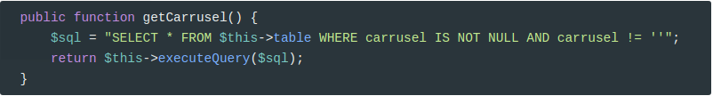

`PageController`

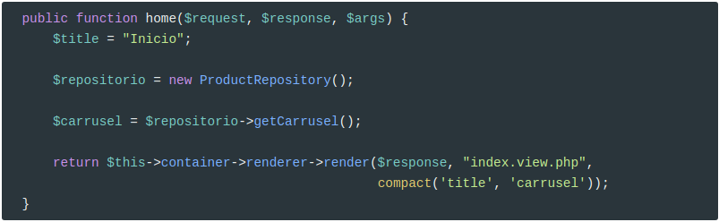

**Partial**

El código de `index.view.php` relativo al carrusel lo movemos a un partial `/partials/carrusel.part.php`:

```html
<div class="row carousel-holder">
   <div class="col-md-12">
      <div id="carousel-example-generic" class="carousel slide" data-ride="carousel">
         <ol class="carousel-indicators">
            <li data-target="#carousel-example-generic" data-slide-to="0" class=""></li>
            <li data-target="#carousel-example-generic" data-slide-to="1" class=""></li>
            <li data-target="#carousel-example-generic" data-slide-to="2" class=""></li>
            <li data-target="#carousel-example-generic" data-slide-to="3" class="active"></li>
            <li data-target="#carousel-example-generic" data-slide-to="4" class=""></li>
         </ol>
         <div class="carousel-inner">
            <div class="item">
               
            </div>
            <div class="item">
               
            </div>
            <div class="item">
               
            </div>
            <div class="item active">
               
            </div>
            <div class="item">
               
            </div>
         </div>
         <a class="left carousel-control" href="#carousel-example-generic" data-slide="prev">
         <span class="glyphicon glyphicon-chevron-left"></span>
         </a>
         <a class="right carousel-control" href="#carousel-example-generic" data-slide="next">
         <span class="glyphicon glyphicon-chevron-right"></span>
         </a>
      </div>
   </div>
</div>
```

Y modificamos `index.view.php` para que incluya este partial:

```php
<?php
  include __DIR__ . "/partials/inicio-doc.part.php";
  include __DIR__ . "/partials/carrusel.part.php"
?>
//Resto de código donde ya se ha eliminado el carrusels
```

Como vemos tiene dos partes: 

* Los ítems de `carousel-indicators`, donde el único valor que cambia es `data-slide-to` y `class`, que es `active` para mostrar la imagen actual.
* Las imágenes en sí, que están contenidas dentro de un `div`. El valor que cambia es el `src` de la imagen y también la clase al igual que antes.

Hacerlo dinámico es muy sencillo. 

Empezamos con `carousel-indicators`:

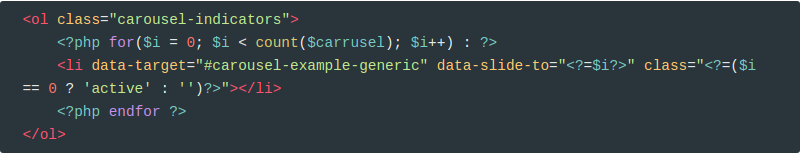

Y continuamos con las imágenes:

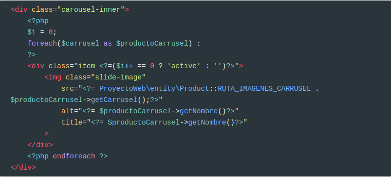

## 1.2 Destacados

Vamos a crear una sección en la portada con los productos destacados:

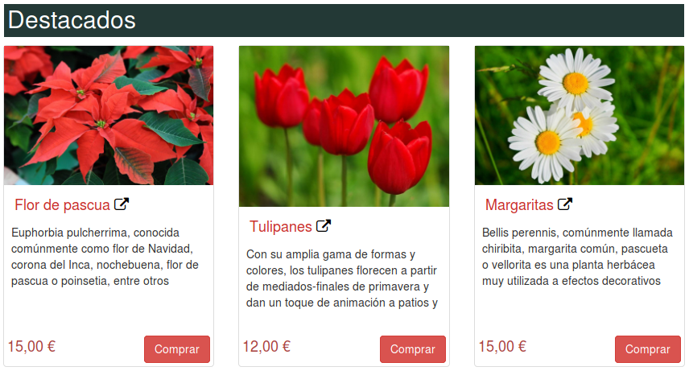

Nos hace falta:

* Un método en el repositorio que nos devuelva los destacados.
* Modificar el controlador para informar la variable que usará el partial.
* Un partial para la miniatura del producto
* Un partial para destacados

`ProductRepository`

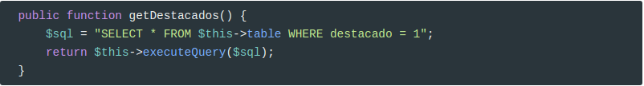

`PageController`

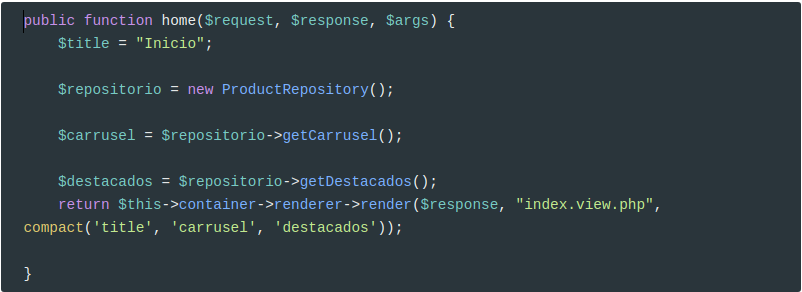

El partial `thumbnail-producto.part.php` de la miniatura es el siguiente:

```html
<div class="col-sm-4 col-lg-4 col-md-4">
    <div class="thumbnail" style="position:relative">
        <a href="#">
            
        </a>
        <div class="caption">
            <h4><a href="#">Margarita</a></h4>
            <p>Bellis perennis, comúnmente llamada margarita, es una planta herbácea de la familia de las asteráceas muy utilizada a efectos decorativos mezclada con el césped, por sus colores y su resistencia a la siega.</p>
        </div>
        <h4 class="pull-right"><span class="text text-danger">100,00 €</span></h4>
        <a href="#" class="btn btn-danger">Comprar</a>
    </div>
</div>
```

Que luego modificamos para que muestre los datos del producto actual.

Partial para destacados, `destacados.part.php`:

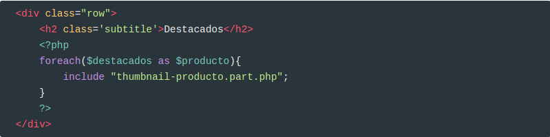

Ya podemos modificar `thumbnail-producto.part.php` con los datos reales del producto:

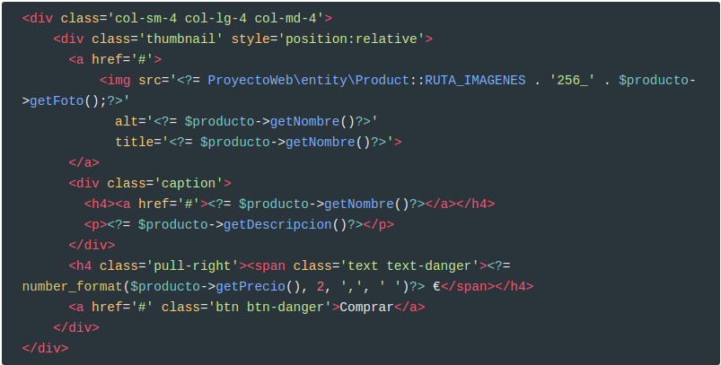

Y modificamos `index.view.php`

```php
<?php
  include __DIR__ . "/partials/inicio-doc.part.php";
  include __DIR__ . "/partials/carrusel.part.php";
  include __DIR__ . "/partials/destacados.part.php";
  include __DIR__ . "/partials/fin-doc.part.php";
?>
```

Y este es el resultado:

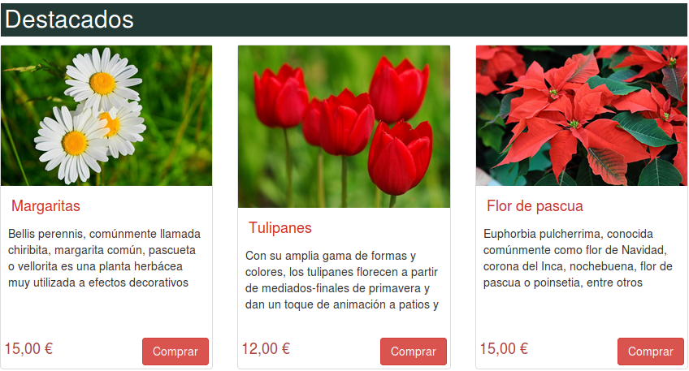

## 1.3 Novedades

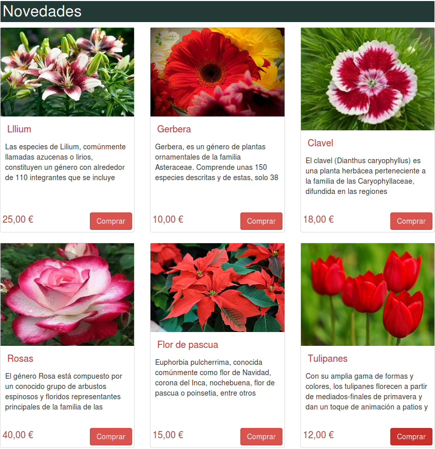

Para la sección de novedades ya sólo hemos de crear:

* Un método en el repositorio que nos devuelva las novedades
* Modificar el controlador para informar la variable que usará el partial.
* Un partial para novedades

`ProductRepository`

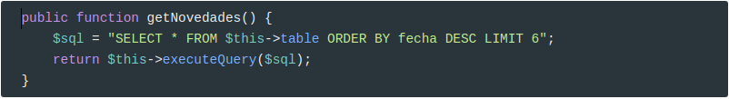

`PageController`

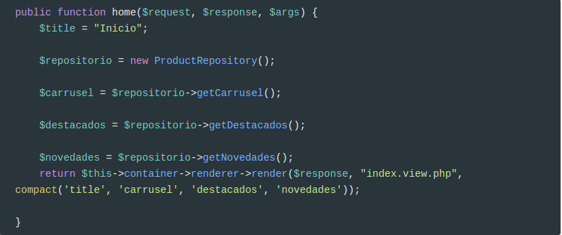

Partial para novedades, `novedades.part.php`:

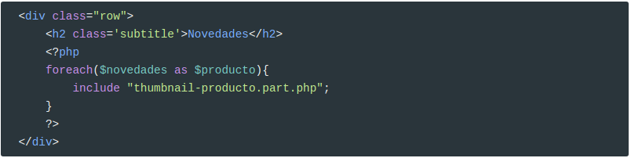

Y modificar `index.view.php`

```php
<?php
  include __DIR__ . "/partials/inicio-doc.part.php";
  include __DIR__ . "/partials/carrusel.part.php";
  include __DIR__ . "/partials/destacados.part.php";
  include __DIR__ . "/partials/novedades.part.php";
  include __DIR__ . "/partials/fin-doc.part.php";
?>
```


## 1.4 Categorías

Por último, nos queda completar la lista de categorías. Sólo nos hace falta:

* inyectar las categorías a la vista
* modificar el partial

Por tanto, en `PageController`:

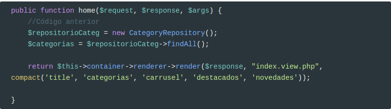

Y modificamos el partial `category.part.php`

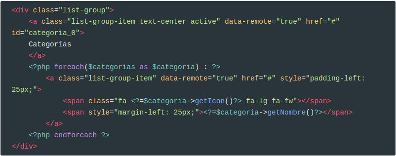

------

**Credits.**

Víctor Ponz victorponz@gmail.com

Este material está licenciado bajo una licencia [Creative Commons, Attribution-NonCommercial-ShareAlike](https://creativecommons.org/licenses/by-nc-sa/3.0/)

