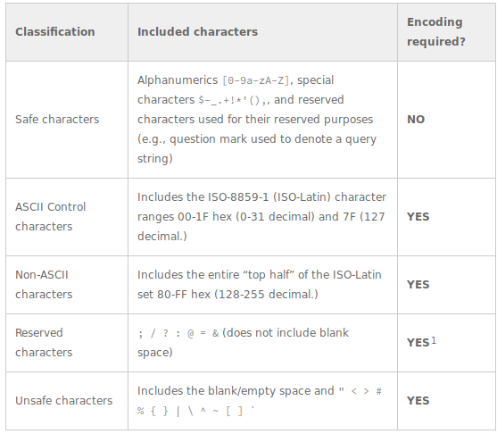

## 2.1 Ficha del producto

Vamos a implementar la ficha del producto:


Para llevarlo a cabo nos hace falta:

* crear un controlador (`ProductController`)
* definir una ruta para cada una de las fichas
* crear un partial para la página
* crear un partial para la ficha

### Primeros pasos

Para empezar crearemos unas rutas y controladores básicos:

`Ruta`

La ruta va a ser del siguiente estilo:

```
127.0.0.1:8080/producto/nombre-del-producto-/id-del-producto
```

De esta forma la hacemos SEO Friendly, aunque realmente el nombre del producto no nos interesa:

Por tanto la ruta en `index.php` es la siguiente:

```php
$app->get('/producto/{nombre}/{id:[0-9]+}', ProductController::class . ':ficha')->setName("ficha");
```

`ProductController`

Como hemos comentado, de momento el controlador es básico. Sólo va a mostrar los datos pasados en la ruta:


La función `extract` hace lo contrario a `compact`; es decir genera variables a partir de las claves de un array asociativo.

Como la ruta define los parámetros `id` y `nombre` , se crean dos variables con dichos nombres.

Si visitamos la página [http://127.0.0.1:8080/producto/Margaritas/1](http://127.0.0.1:8080/producto/Margaritas/1) nos mostrará los dos parámetros:


### Finalizar la página

Ahora ya podemos empezar a crear las vistas y a juntarlo todo.

Creamos el partial para la ficha `ficha.part.php`, a partir del siguiente HTML:

```html
<div id="ficha-producto" class="row">
  <h2 class="subtitle">Margaritas</h2>
  
  <div class="caption">
    <p class="lead">Bellis perennis, comúnmente llamada chiribita, margarita común, pascueta o vellorita es una planta herbácea muy utilizada a efectos decorativos mezclada con ...</p>
  </div>
  <h4 class="pull-right"><span class="text text-danger">13,50€</span></h4>
  <a href="#" class="btn btn-danger">Comprar</a>  
</div>
```

Y del siguiente css que introducimos en `shop-homepage.css`

```css
#ficha-producto{
  position:relative; 
  border:1px solid #ddd; 
  border-radius:4px; 
  padding:4px;
  margin: 0 0 10px 0;
}
#ficha-producto h2{
  margin:0;
}
#ficha-producto .caption {
  margin-top:10px;
}
#ficha-producto h4{
  position:absolute; 
  bottom:4px; 
  left:4px;
}
#ficha-producto .btn.btn-danger{
  position:absolute; 
  bottom:4px; 
  right:4px;
}
```

Creamos la vista `product.view.php`

```php
<?php
  include __DIR__ . "/partials/inicio-doc.part.php";
  include __DIR__ . "/partials/ficha.part.php";
  include __DIR__ . "/partials/fin-doc.part.php";
?>
```

Y modificamos el controlador:


Y modificamos el partial para mostrar los datos reales del producto:

```php+HTML
<div id="ficha-producto" class="row">
  <h2 class="subtitle"><?= $producto->getNombre()?></h2>
  getFoto();?>" 
       alt="<?= $producto->getNombre()?>" 
       title="<?= $producto->getNombre()?>">
  <div class="caption">
    <p class="lead"><?= $producto->getDescripcion()?><p>
  </div>
  <h4 class="pull-right"><span class="text text-danger"><?= number_format($producto->getPrecio(), 2, ',', ' ')?> €</span></h4>
  <a href="#" class="btn btn-danger">Comprar</a>  
</div>
```

Y ya lo tenemos todo.

## 2.2 Productos relacionados


Vamos a implementar una lista con otros productos que tal vez puedan interesar al usuario. En un sistema real (pensad en Amazon) tienen una serie de complejos algoritmos. Nosotros implementamos un algoritmo muy sencillo que tal vez en un futuro se pueda mejorar :). Pero la lógica de la página sigue siendo la misma.

Para realizar este apartado, nos hace falta:

* un método en el repositorio
* un partial
* modificar el controlador
* modificar la vista

`ProductRepository`


Partial `relacionados.part.php`

```php+HTML
<div class="row">
    <h2 class='subtitle'>También te puede interesar</h2>
    <?php
    foreach($relacionados as $producto){
        include "thumbnail-producto.part.php";
    }
    ?>
</div>
```

`ProductController`, donde añadimos los productos relacionados ( `$relacionados`)

```php
public function ficha($request, $response, $args) {
    extract($args);
    $repositoryCateg = new CategoryRepository();
    $categorias = $repositoryCateg->findAll();
    $repositorio = new ProductRepository();
    try{
        $producto =$repositorio->findById($id);
    }catch(NotFoundException $nfe){
        $response = new \Slim\Http\Response(404);
        return $response->write("Producto no encontrado");
    }
    $title = $producto->getNombre();
    $relacionados = $repositorio->getRelacionados($producto);
    return $this->container->renderer->render($response, "product.view.php", compact('title', 'categorias', 'producto', 'relacionados'));
}
```

Y por último, la vista `product.view.php`

```php
<?php
  include __DIR__ . "/partials/inicio-doc.part.php";
  include __DIR__ . "/partials/ficha.part.php";
  include __DIR__ . "/partials/relacionados.part.php";
  include __DIR__ . "/partials/fin-doc.part.php";
?>
```

## 2.3 Thumbnail del producto

Una vez tenemos hecha la ficha del producto, ya podemos modificar el thumbnail para que los enlaces apunten a la misma.

Para ello, modificamos el partial `thumbnail-producto.part.php` pero nos hace falta conocer cuál es la ruta a los productos, por lo que hemos de inyectar el router de slim en index.php 

```php
$templateVariables = [
    "basePath" => $container->request->getUri()->getBasePath(),
    "userName" => ($_SESSION['username'] ?? ''),
    "withCategories" => true,
    "router" => $container->router
];
```

Y ahora usarlo en el partial:

```php
<?=$router->pathFor('ficha', ['nombre' => rawurlencode($producto->getNombre()), 'id' => $producto->getId()])?>
```

Cuidado con los caracteres no-alfanuméricos: es importante que las urls estén codificadas según los estándares:

* [RFC3986: Uniform Resource Identifier (URI): Generic Syntax](https://www.ietf.org/rfc/rfc3986.txt)
* [RFC1738: Uniform Resource Locators (URL)](https://www.ietf.org/rfc/rfc1738.txt)

La siguiente tabla, obtenida de https://perishablepress.com/stop-using-unsafe-characters-in-urls/,  muestra qué caracteres se deben codificar y cuáles no:



> **Nota**. Seguramente en el framework que uséis ya existirá un método para generar `slugs` que es como se denominan técnicamente estos generadores de url

Nosotros los haremos más sencillo usando la función `rawurlencode`. 

Por ejemplo `Flor de pascua` se convertirá en `Flor%20de%20pascua`. Esto es importante para temas de SEO. También se pueden usar otras técnicas, como cambiar los espacios en blanco por `- `, eliminar los caracteres extraños, escribir todas las letras en minúsculas, quitar acentos, quitar stop words ...

Así que vamos a crear un método en `ProyectoWeb\app\utils\Utils` para que nos genere URI's válidos:

```php
public static function encodeURI(string $uri): string{
    return rawurlencode(strtolower(str_replace(' ', '-', $uri)));
}
```

Y ya podemos modificar `thumbnail-producto.part.php`

```php+HTML
<div class='col-sm-4 col-lg-4 col-md-4'>
    <div class='thumbnail' style='position:relative'>
      <a href='<?=$router->pathFor('ficha', ['nombre' =>  ProyectoWeb\app\utils\Utils::encodeURI($producto->getNombre()), 'id' => $producto->getId()])?>'>
          getFoto();?>' 
            alt='<?= $producto->getNombre()?>'
            title='<?= $producto->getNombre()?>'>
      </a>
      <div class='caption'>
        <h4><a href='<?=$router->pathFor('ficha', ['nombre' =>  ProyectoWeb\app\utils\Utils::encodeURI($producto->getNombre()), 'id' => $producto->getId()])?>'><?= $producto->getNombre()?></a></h4>
        <p><?= $producto->getDescripcion()?></p>
      </div>
      <h4 class='pull-right'><span class='text text-danger'><?= number_format($producto->getPrecio(), 2, ',', ' ')?> €</span></h4>
      <a href='#' class='btn btn-danger'>Comprar</a>
    </div>
</div>
```


**Credits.**

Víctor Ponz victorponz@gmail.com

Este material está licenciado bajo una licencia [Creative Commons, Attribution-NonCommercial-ShareAlike](https://creativecommons.org/licenses/by-nc-sa/3.0/)

