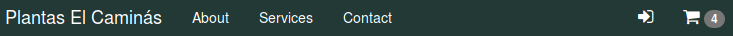

Vamos a implementar el carro de la compra.

Para ello es necesario:

* almacenar en la sesión los productos que se van comprando
* crear una ruta
* crear un controlador
* crear el partial del carrito
* crear la vista

# 4.1 Class Cart

Primero creamos una clase para el carro de la compra que almacena un array con los id's de los productos comprados y la cantidad en la sesión.

<script src="https://gist.github.com/victorponz/1dd5d1320608cee0895c547c48c6a47e.js"></script>

Para que el carrito esté disponible en toda nuestra aplicación, modificamos el controlador frontal para añadirlo al contenedor de servicios de Slim. Además lo añadimos a las variables de las plantillas.

```php
use ProyectoWeb\core\Cart;
//....
$container['cart'] = new Cart();
$templateVariables = [
    "basePath" => $container->request->getUri()->getBasePath(),
    "userName" => ($_SESSION['username'] ?? ''),
    "withCategories" => true,
    "router" => $container->router,
    "cart" => $container->cart 
];
```

## Ruta


## `cart.part.php`

Como se ve en el código, la parte que se repetirá es:

```html
     <tr>
        <th scope="row">1</th>
        <td><a href="#">Flor de pascua</a><a href="#"></a></td>
        <td>1</td>
        <td>15,00 €</td>
        <td>15,00 €</td>
      </tr>
```

Y el resto es código fijo a excepción de total del carro:

```html
 <b>Total: 15,00 €</b>
```

Estas dos partes son las que más adelante generaremos con php.

```html
<div class="row carro">
  <h2 class="subtitle" style="margin:0">Carrito de la compra</h2>
  <table class="table">
    <thead>
      <tr>
        <th>#</th>
        <th>Producto</th>
        <th>Cantidad</th>
        <th>Precio</th>
        <th>Total</th>
      </tr>
    </thead>
    <tbody>
      <tr>
        <th scope="row">1</th>
        <td><a href="#">Flor de pascua</a><a href="#"></a></td>
        <td>1</td>
        <td>15,00 €</td>
        <td>15,00 €</td>
      </tr>
    </tbody
    <tfoot>
      <tr>
        <td colspan="5" style="text-align:right;">
          <b>Total: 15,00 €</b>
        </td>
      </tr>
      <tr>
        <td colspan="3"><a class="btn btn-danger" href="#">Finalizar compra</a></td>
        <td colspan="2"><a class="btn btn-danger" href="#">Vaciar Carrito</a></td>
      </tr>
    </tfoot>
  </table>
</div>
```

## `cart.view.php`

```PHP
<?php
  include __DIR__ . "/partials/inicio-doc.part.php";
  include __DIR__ . "/partials/cart.part.php";
  include __DIR__ . "/partials/fin-doc.part.php";
?>
```

## `CartController`

```php
<?php
namespace ProyectoWeb\app\controllers;

use Psr\Container\ContainerInterface;
use ProyectoWeb\entity\Product;
use ProyectoWeb\exceptions\QueryException;
use ProyectoWeb\exceptions\NotFoundException;
use ProyectoWeb\database\Connection;
use ProyectoWeb\repository\ProductRepository;
use ProyectoWeb\core\App;

class CartController
{
    protected $container;
   
    // constructor receives container instance
    public function __construct(ContainerInterface $container) {
        $this->container = $container;
    }
    public function render($request, $response, $args) {
        extract($args);
        $title = " Carrito ";
        $withCategories = false;
        return $this->container->renderer->render($response, "cart.view.php", compact('title', 'withCategories'));
    }
}
```

# 4.2 Añadir al carrito

Para añadir al carrito, hemos de:

* definir una ruta
* crear un controlador
* crear un método en el repositorio que nos devuelva los productos del carrito
* modificar el partial con los datos reales

## Ruta

Creamos una ruta que nos permita añadir un `id` de producto y su cantidad que la hacemos opcional ya que va entre corchetes.


## `CartController`

```php
public function add($request, $response, $args) {
    extract($args);
    $quantity = ($quantity ?? 1);
    $respitorio = new ProductRepository;
    try {
        $producto = $respitorio->findById($id);
        $this->container->cart->addItem($id, $quantity);
        
    }catch(NotFoundException $nfe){
        ;
    }
    return $response->withRedirect($this->container->router->pathFor('cart'), 303);
}
```

Añadir al carrito es muy sencillo:

1. Se añade el producto
2. Se redirige a la página que muestra el carrito (todavía no mostramos los datos reales).

## Retoques finales

Una vez podemos añadir productos al carro, ya podemos finalizar el partial con datos reales. Como siempre, nos hace falta un método en el repositorio de productos que nos devuelva los productos que hay actualmente en el carro:


Modificamos el método `render` para incorporar los productos:


Y ya podemos modificar el partial.

Obtener la cantidad de cada producto es tan sencillo como

```php
$cart->getCart()[$producto->getId()]
```

De tal forma que el código final del partial sería el siguiente:

```php+HTML
<div class="row carro">
  <h2 class="subtitle" style="margin:0;">Carrito de la compra</h2>
  <table class="table">
    <thead>
      <tr>
        <th>#</th>
        <th>Producto</th>
        <th>Cantidad</th>
        <th>Precio</th>
        <th>Total</th>
      </tr>
    </thead>
    <tbody>
    <?php if ($cart->isEmpty()) : ?>
      <tr>
        <td colspan='5'>
          <div class='alert alert-danger'>Su carro está vacío.</div>
        </td>
      </tr>
    <?php else : ?>
      <?php $i = 1;
        $total = 0;
        foreach ($productos as $producto) :
          $total += $cart->getCart()[$producto->getId()] * $producto->getPrecio();
        ?>
      <tr>
        <th scope="row"><?=$i++;?></th>
        <td><a href="<?=$router->pathFor('ficha', ['nombre' =>  ProyectoWeb\app\utils\Utils::encodeURI($producto->getNombre()), 'id' => $producto->getId()])?>"><?= $producto->getNombre()?></a></td>
        <td><?= number_format($producto->getPrecio(), 2, ',', ' ')?> €</td>
        <td><?= $cart->getCart()[$producto->getId()] ?></td>
        <td><?=  number_format($cart->getCart()[$producto->getId()] * $producto->getPrecio(), 2, ',', ' '); ?> €</td>
      </tr>
      <?php endforeach ?>
    </tbody>
    <tfoot>
      <tr>
        <td colspan="5" style="text-align:right;">
          <b>Total: <?= number_format($total, 2, ',', ' ')?> €</b>
        </td>
      </tr>
      <tr>
        <td colspan="3"><a class="btn btn-danger" href="#">Finalizar compra</a></td>
        <td colspan="2"><a class="btn btn-danger" href="#">Vaciar Carrito</a></td>
      </tr>
    </tfoot>
    <?php endif ?>
  </table>
</div>
```

Ya podemos crear los enlaces al carrito en el thumbnail y la ficha.

Por ejemplo, en `thumbnail-producto.part.php`

```diff
//Formato diff
@@ -10,6 +10,6 @@
         <p><?= $producto->getDescripcion()?></p>
       </div>
       <h4 class='pull-right'><span class='text text-danger'><?= number_format($producto->getPrecio(), 2, ',', ' ')?> €</span></h4>
-      <a href='#' class='btn btn-danger'>Comprar</a>
+      <a href='<?=$router->pathFor('cart-add', ['id' => $producto->getId()])?>' class='btn btn-danger'>Comprar</a>
     </div>
 </div>
```

Y modificar el menú de nuestra web, `menu.part.php`:



```diff
//Formato diff
		<?php endif ?>

         <li>
-            <a href=''><span title='Carrito' class='fa fa-shopping-cart'></span> <span class="badge">0</span></a>
+            <a href='<?=$router->pathFor('cart')?>'><span title='Carrito' class='fa fa-shopping-cart'></span> <span class="badge"><?=$cart->howMany()?></span></a>
         </li>
     </ul>
 </div>
```

# 4.3 Vaciar el carrito

Vaciar el carro es tan sencillo como llamar al método `empty` y redireccionar a la ruta del carro. Primero creamos la ruta:

```php
$app->get('/cart/empty', CartController::class . ':empty')->setName("cart-empty");
```

Creamos el método en el controlador:

```php
public function empty($request, $response, $args) {
    extract($args);
    $this->container['cart']->empty();
    
    return $response->withRedirect($this->container->router->pathFor('cart'), 303);
}
```

Y modificamos el enlace en el botón **Vaciar Carrito**:

```php
<a class="btn btn-danger" href="<?=$router->pathFor('cart-empty')?>">Vaciar Carrito</a>
```

Para pedir confirmación antes de vaciarlo, creamos un script llamado `js/app.js`, donde iremos creando métodos para toda nuestra aplicación:

```javascript
function confirmEmptyCart(){
    //Siempre que una acción no se pueda deshacer hay que pedir confirmación al usuario
    if (confirm("¿Seguro que desea vaciar el carrito? "))
        return true;
    else
        return false;
}
```

Y modificamos el partial, `fin-doc.part.php` para incluir este script:

```diff
//Formato diff
 <script src="<?=$basePath;?>/js/jquery.js"></script>
 <!-- Bootstrap Core JavaScript -->
 <script src="<?=$basePath;?>/js/bootstrap.min.js"></script>
+<script src="<?=$basePath;?>/js/app.js"></script>
 </body>

 </html>
```

Ahora ya tenemos tanto la ruta para vaciar el carrito como el javascript para pedir confirmación, por lo que modificamos el partial `cart.part.php`  añadiendo:

```javascript
onclick="return confirmEmptyCart();"
```

De tal manera que el código del botón quedaría como sigue:

```php+HTML
<a class="btn btn-danger" href="<?=$router->pathFor('cart-empty')?>" onclick="return confirmEmptyCart();">Vaciar Carrito</a>
```

# 4.4 Eliminar un producto

Para eliminar un producto, creamos una nueva ruta:

```php
$app->get('/cart/delete/{id:[0-9]+}', CartController::class . ':delete')->setName("cart-delete");
```

Y el controlador:

```php
public function delete($request, $response, $args) {
    extract($args);
    
    $this->container['cart']->deleteItem($id);
    return $response->withRedirect($this->container->router->pathFor('cart'), 303);
    
}
```

Siempre que se va a realizar una acción que no se pueda deshacer hemos de pedir confirmación al usuario. Por tanto añadimos un método para pedir confirmación en `js/app.js`

```javascript
function confirmDeleteItem(){
    //Siempre que una acción no se pueda deshacer hay que pedir confirmación al usuario
    if (confirm("¿Seguro que desea eliminar este producto? "))
        return true;
    else
        return false;
}
```

Y modificamos la vista `cart.part.php`

```diff
//Formato diff
@@ -8,12 +8,13 @@
         <th>Cantidad</th>
         <th>Precio</th>
         <th>Total</th>
+        <th></th>
       </tr>
     </thead>
     <tbody>
     <?php if ($cart->isEmpty()) : ?>
       <tr>
-        <td colspan='5'>
+        <td colspan='6'>
           <div class='alert alert-danger'>Su carro está vacío.</div>
         </td>
       </tr>
@@ -26,6 +27,7 @@
         <td><?=$producto['cantidad']?></td>
         <td><?= number_format($producto['producto']->getPrecio(), 2, ',', ' ')?> €</td>
         <td><?= number_format($producto['total'], 2, ',', ' ')?></td>
+        <td><a href="<?=$router->pathFor('cart-delete', ['id' => $producto['producto']->getId()])?>" onclick="return confirmDeleteItem();"><span class='fa fa-close'></span></a></td>
       </tr>
       <?php endforeach ?>
     </tbody>
@@ -33,7 +35,7 @@
       <tr>
-        <td colspan="5" style="text-align:right;">
+        <td colspan="6" style="text-align:right;">
           <b>Total: <?= number_format($total, 2, ',', ' ')?> €</b>
         </td>
       </tr>

```


# 4.5 Proceso de pago con PayPal

`PayPal` dispone de un simulador de pagos llamado `sandbox`, en el que nos podemos crear una cuenta para realizar pagos ficticios. Este simulador dispone de las mismas funcionalidades que la versión `Life`.

Para crearse una cuenta en `PayPal` Sandbox hay que visitar [https://www.sandbox.paypal.com/es/webapps/mpp/merchant](https://www.sandbox.paypal.com/es/webapps/mpp/merchant)

Yo ya he creado una cuenta con mis credenciales que podéis usar en vuestro carro de la compra. Pero si alguien está interesado en crear la suya, lo puede hacer en la página anterior.

Al crear una cuenta en el `sandbox`, `PayPal` crea dos usuarios ficticios: uno para el vendedor \(**victor.ponz-facilitator at ieselcaminas.org**\) y otro para el comprador \(**victor.ponz-buyer at ieselcaminas.org**\).

## Crear cuentas en Sandbox

Para crear estas cuentas hay que visitar la página [https://developer.paypal.com/developer/accounts](https://developer.paypal.com/developer/accounts)


## Crear  una app

Para poder realizar llamadas a la API de pago hay que crear una `REST API app`. Esto nos generará una clave \(**Client ID**\) que utilizaremos en todas las llamadas a la misma.

Las aplicaciones se crean en la página [https://developer.paypal.com/developer/applications/](https://developer.paypal.com/developer/applications/)

En mi caso ya está creada y estos son los datos de la misma.

## Proceso de pago con PHP

Para integrar PayPal con nuestra aplicación existen diversos métodos.  Nosotros usaremos **Client Side Express Checkout using REST** porque se realiza con `Javascript` y es el recomendado por `PayPal`.

El código necesario para realizar el pago se encuentra en [https://developer.paypal.com/demo/checkout/\#/pattern/client](https://developer.paypal.com/demo/checkout/#/pattern/client)

```html
<!DOCTYPE html>

<head>
    <meta http-equiv="X-UA-Compatible" content="IE=edge" />
    <meta name="viewport" content="width=device-width, initial-scale=1">
    <script src="https://www.paypalobjects.com/api/checkout.js"></script>
</head>

<body>


    <script>
        paypal.Button.render({

            env: 'sandbox', // sandbox | production

            // PayPal Client IDs - replace with your own
            // Create a PayPal app: https://developer.paypal.com/developer/applications/create
            client: {
                sandbox:    'AZDxjDScFpQtjWTOUtWKbyN_bDt4OgqaF4eYXlewfBP4-8aqX3PiV8e1GWU6liB2CUXlkA59kJXE7M6R',
                production: '<insert production client id>'
            },

            // Show the buyer a 'Pay Now' button in the checkout flow
            commit: true,

            // payment() is called when the button is clicked
            payment: function(data, actions) {

                // Make a call to the REST api to create the payment
                return actions.payment.create({
                    payment: {
                        transactions: [
                            {
                                amount: { total: '0.01', currency: 'USD' }
                            }
                        ]
                    }
                });
            },

            // onAuthorize() is called when the buyer approves the payment
            onAuthorize: function(data, actions) {

                // Make a call to the REST api to execute the payment
                return actions.payment.execute().then(function() {
                    window.alert('Payment Complete!');
                });
            }

        }, '#paypal-button-container');

    </script>
</body>
```

### Ruta


### Controlador


> **Nota**. Hemos añadido dos nuevas variables a la vista: `$checkout` y `$header` , por lo que también se la añadimos en render():
>
> ```DIFF
> //Formato diff
> @@ -2,6 +2,8 @@
>      extract($args);
>      $title = "Carrito";
>      $withCategories = false;
> +    $header = "Carrito de la compra";
> +    $checkout = false;
>  
>      $repositorio = new ProductRepository();
>      $lineas = array();
> @@ -11,5 +13,5 @@
>          $lineas = $items['productos'];
>          $total = $items['total']; 
>      }
> -    return $this->container->renderer->render($response, "cart.view.php", compact('title', 'lineas', 'total', 'withCategories'));
> +    return $this->container->renderer->render($response, "cart.view.php", compact('title', 'header', 'checkout', 'lineas', 'total', 'withCategories'));
>  }
> 
> ```
>
>

### Vista

Modificamos el partial `cart.part.php` para que muestre el botón de PayPal y no muestre el resto de botones.


```diff
//Formato diff
@@ -1,5 +1,5 @@
 <div class="row carro">
-  <h2 class="subtitle" style="margin:0;">Carrito de la compra</h2>
+  <h2 class="subtitle" style="margin:0;"><?= $header; ?></h2>
   <table class="table">
     <thead>
       <tr>
@@ -38,10 +38,62 @@
         </td>
       </tr>
       <tr>
+      <?php if(!$checkout) :?>
-         <td colspan="3"><a class="btn btn-danger" href="#">Finalizar compra</a></td>
+         <td colspan="3"><a class="btn btn-danger" href="<?=$router->pathFor('cart-checkout')?>">Finalizar compra</a></td>
         <td colspan="4"><a class="btn btn-danger" href="<?=$router->pathFor('cart-empty')?>" onclick="return confirmEmptyCart();">Vaciar Carrito</a></td>
+      <?php else : ?>
+        <td colspan="7">
+          <div id="paypal-button-container"></div>
+        </td>
+      <?php endif ?>
       </tr>
     </tfoot>
     <?php endif ?>
   </table>
 </div>
 //*******************IMPORTANTE *****************************
 // COPIAD DE AQUÍ HASTA EL FINAL.
 //***********************************************************
<?php if($checkout): ?>
<script src="https://www.paypalobjects.com/api/checkout.js"></script>
<script>
        paypal.Button.render({

            env: 'sandbox', // sandbox | production

            // PayPal Client IDs - replace with your own
            // Create a PayPal app: https://developer.paypal.com/developer/applications/create
            client: {
                sandbox:    'AZDxjDScFpQtjWTOUtWKbyN_bDt4OgqaF4eYXlewfBP4-8aqX3PiV8e1GWU6liB2CUXlkA59kJXE7M6R',
                production: '<insert production client id>'
            },

            // Show the buyer a 'Pay Now' button in the checkout flow
            commit: true,

            // payment() is called when the button is clicked
            payment: function(data, actions) {

                // Make a call to the REST api to create the payment
                return actions.payment.create({
                    payment: {
                        transactions: [
                            {
                                amount: { total: '<?=$producto['total']?>', currency: 'EUR' }
                            }
                        ]
                    }
                });
            },

            // onAuthorize() is called when the buyer approves the payment
            onAuthorize: function(data, actions) {

                // Make a call to the REST api to execute the payment
                return actions.payment.execute().then(function() {
                  window.alert('Pago Completado!');
                });
            }

        }, '#paypal-button-container');

    </script>
<?php endif ?>
//FIN COPIAR
```

En este código hay varias cosas importantes:

**El contenedor del botón**

```html
<div id="paypal-button-container"></div>
```

En este `div` se mostrará el botón de pago de `PayPal`. Fijaos en el parámetro que se le pasa a la función `render`

```html
<script>
        paypal.Button.render({
            ......
       }, '#paypal-button-container');
</script>
```

**El Client ID**

```javascript
client: {
sandbox: 'AZDxjDScFpQtjWTOUtWKbyN_bDt4OgqaF4eYXlewfBP4-8aqX3PiV8e1GWU6liB2CUXlkA59kJXE7M6R',
production: '<insert production client id>'
},
```

Hemos de cambiar el Client ID por el apropiado. Para la app que ya he creado es  
`AURtFahgo3cuV-8J35gOhzh0AhTk36fnkHRkuGs-ZBiDoRdzd4NGvRDFFvzkCqmoU3puoZ3FOyS2zkDX`

**El importe del carro**

```javascript
amount: { total: '0.01', currency: 'USD' }
```

Por tanto, hay que cambiar el campo `total` por el total del carro, `$producto['total']` y en el campo `currency` hemos de poner `EUR`

**Finalizar el proceso**  

Cuando el usuario hace clic en el botón de PayPal aparece una ventana emergente para que el cliente introduzca sus credenciales:

  
Podéis usar el usuario de prueba `victor.ponz-buyer@ieselcaminas.org` con contraseña `caminas2017`

Cuando el proceso acaba, `PayPal` llama a la función Javascript `onAuthorize` que debemos modificar para que además de mostrar una alerta sobre pago completado, redirija el navegador a una página de gracias (ruta `cart-thankyou`)

Por tanto, creamos una nueva ruta:


Y modificar el javascript:
```javascript
onAuthorize: function(data, actions) {

    // Make a call to the REST api to execute the payment
    return actions.payment.execute().then(function() {
      window.alert('Pago Completado!');
      document.location.href = '<?=$router->pathFor('cart-thankyou')?>';
    });
}
```

En esta página, debemos vaciar el carro y mostrar un mensaje de agradecimiento.

Creamos un partial `thankyou.part.php `

```php
<div class="row">
    <div class="jumbotron">
        <h1>Gracias</h1>
        <p> Gracias por realizar su compra con nosotros</p>
        <p><a class="btn btn-primary btn-lg" href="<?=$router->pathFor('home');?>" role="button">Continuar</a></p>
    </div>
</div>
```

Y su vista `thankyou.view.php`

```php
<?php
  include __DIR__ . "/partials/inicio-doc.part.php";
  include __DIR__ . "/partials/thankyou.part.php";
  include __DIR__ . "/partials/fin-doc.part.php";
?>
```
Y creamos el controlador:


> **IMPORTANTE** En un entorno real, deberíamos insertar un pedido en la base de datos y después vaciar el carrito. Pero esto, de momento, no lo hacemos porque no nos aporta conocimientos nuevos \(bueno, realmente hay que hacer todo el proceso con transacciones de base de datos, pero no lo vamos a ver\). Si alguien está interesado, debe crear dos tablas: pedidos y linea\_pedido. La primera tiene los datos del pedido \(sobre todo del cliente y de la forma de pago\) y la segunda tiene una línea por cada uno de los artículos comprados. En ambas tablas debéis copiar **TODOS** los datos tanto del cliente como del producto ya que estos pueden variar a lo largo del tiempo. Además debemos introducir los datos de trazabilidad que pone a nuestra disposición `PayPal` al finalizar la transacción -paymentToken, paymentID, payerID, etc -
>
> También se debería enviar un correo con los datos del pedido.

### Finalizar compra

Por último, ya podemos modificar la url del botón **Finalizar Compra**.

```php+HTML
<a class="btn btn-danger" href="<?=$router->pathFor('cart-checkout')?>">Finalizar compra</a>
```

### Usuario registrado

En la página de checkout, el usuario debe estar registrado. Por tanto, en el controlador lo comprobamos y redirigimos en caso contrario.


# 4.6 Modal para el carro


Ahora que ya tenemos el carro funcional, podemos empezar a usar javascript para hacer la web más llamativa.

### Partial

Vamos a usar las ventanas modales que ya vienen por defecto en [Bootstrap](https://getbootstrap.com/docs/3.3/javascript/#modals).

Este es el partial, `modal-carro.part.php`, de nuestra ventana modal:

```html
<div class="modal fade" id="infoCarroProducto" tabindex="-1" role="dialog" aria-labelledby="myModalLabel">
  <div class="modal-dialog modal-lg" role="document">
    <div class="modal-content">
      <div class="modal-header">
        <button type="button" class="close" data-dismiss="modal" aria-label="Close"><span aria-hidden="true">&times;</span></button>
        <h4 class="modal-title" id="myModalLabel">Producto añadido correctamente a su carrito</h4>
      </div>
      <div class="modal-body">
        <div id='data-container'>
          <div class="row">
            <div class="col-md-3">
                
            </div>
            <div class="col-md-9">
                <h4 class='title'></h4>
                <p class='desc'></p>
                <input type='number' min='1' id='cantidad' value=1><button class='update' class='btn'>Actualizar</button>
            </div>
          </div>
          <hr>
          <div class="row">
            <div class="col-md-4" >
              <a href="<?=$router->pathFor('cart')?>" class="btn btn-primary">Ver carrito</a>
            </div>
            <div class="col-md-4 col-md-offset-4">
                <div class='pull-right'>
                  <b>Total carrito: <span class='total'></span> €</b>
                </div>
            </div>
          </div>
        </div>
      </div>
    </div>
  </div>
</div>
```

Añadimos este partial a `index.view.php`, `categoria.view.php` y `product.view.php`

### Javascript

Para mostrar la ventana modal, sólo hace falta un poco de javascript que incluimos en `js/app.js`

```php
function attachCarro(){
  //El elemento dom con la plantilla del carro
  var infoCarro = $("#infoCarroProducto");
  //selector css del botón comprar del producto
  $( ".thumbnail .btn.btn-danger, #ficha-producto .btn.btn-danger" ).click(
      function(event) {
    	event.preventDefault();
    	infoCarro.modal();
  	  }
  );
}
attachCarro();
```

Fijaos que `infoCarroProducto `es el *id* de la ventana modal.

En vez de usar la función de esta forma, es decir, definirla y luego hacer `attachCarro()`, vamos a usar [Immediately-Invoked Function Expression (IIFE)](https://flaviocopes.com/javascript-iife/)

```javascript
//Immediately-Invoked Function Expression (IIFE)
(function(){
    //El elemento dom con la plantilla del carro
    var infoCarro = $("#infoCarroProducto");
    //selector css del botón comprar del producto
    $( ".thumbnail .btn.btn-danger, #ficha-producto .btn.btn-danger" ).click(
      function(event) {
    	event.preventDefault();
    	infoCarro.modal();
  	  }
  );
})();
```

Si todo va bien, nos debe mostrar una ventana modal. Hay que tener en cuenta que **todavía no hace nada**!


Ahora ya podemos completar la funcionalidad.

### Máscara

Siempre que hagamos cargas asíncronas es conveniente mostrar una máscara para que el usuario no pueda hacer clic en ningún otro elemento del UI.

Así que hacemos un partial, `mask.part.php` que incluimos en `index.view.php`, `categoria.view.php` y `product.view.php`:

```php+HTML
<div id="mask" style="position: fixed; width: 100%; height: 100%; top: 0px; left: 0px; z-index: 1040;
  background-color: white;  opacity: .9; display:none">
    <div class="alert alert-info" role="alert" style='position: absolute;  top: 30%;  left: 50%;  transform: translate(-30%, -50%);'>
        /css/loading_animation.gif"> Cargando ...
    </div>
</div>
```

Y ahora la mostramos mediante javascript;

```javascript
//Immediately-Invoked Function Expression (IIFE)
(function(){
    //El elemento dom con la plantilla del carro
    var infoCarro = $("#infoCarroProducto");
    //El elemento dom de la máscara
    var mask = $("#mask");
    //selector css del botón comprar del producto
    $( ".thumbnail .btn.btn-danger, #ficha-producto .btn.btn-danger" ).click(function(event) {
        event.preventDefault();
        mask.show();
        //Ocultar la máscara y mostrar la información
        //Le pongo un timeout para que veáis el efecto. En real se podría eliminar
        setTimeout(function(){
            mask.hide();
            infoCarro.modal();
        }, 500);
    });
})();
```

### Ruta para POST

Ahora los datos los vamos a enviar de forma asíncrona mediante POST y devolvemos datos en formato JSON.

Por tanto, modificamos la ruta `cart-add`:


Y el controlador:


Además, creamos una ruta para actualizar la cantidad de un producto en el carro, que sólo se va a hacer desde la ventana modal mediante post.


Y su controlador:


Además, vamos a añadir un atributo en los enlaces a comprar que almacene la ruta a `update` de cada producto. Este atributo lo usaremos en javascript para saber cuál es la ruta exacta de cada producto.

En `thumbnail-producto.part.php`:

```php+HTML
<a href='<?=$router->pathFor('cart-add', ['id' => $producto->getId()])?>' 
   data-href-update='<?=$router->pathFor('cart-update', 
                                         ['id' => $producto->getId()])?>'
   class='btn btn-danger'>Comprar</a>
```

Y en `ficha.part.php`

```php+HTML
<a href="<?=$router->pathFor('cart-add', ['id' => $producto->getId()])?>" 
   data-href-update='<?=$router->pathFor('cart-update', 
                                         ['id' => $producto->getId()])?>' 
   class="btn btn-danger">Comprar</a>  
```

### Javascript completo

Una vez tenemos todas las partes, ya podemos finalizar el javascript. Básicamente lo que hace es obtener la url del producto en el que hemos clicado **Comprar** y hacer una petición por POST. Con los datos devueltos en formato JSON, modifica la plantilla del carrito. 

Para actualizar la cantidad, hace una petición POST a la ruta definida en el atributo `data-href-update`
<script src="https://gist.github.com/victorponz/adcbbcb967083e2ea76c1f2ad7349941.js"></script>

------

**Credits.**

Víctor Ponz victorponz@gmail.com

Este material está licenciado bajo una licencia [Creative Commons, Attribution-NonCommercial-ShareAlike](https://creativecommons.org/licenses/by-nc-sa/3.0/)

