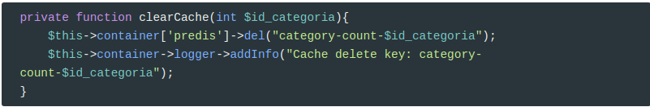
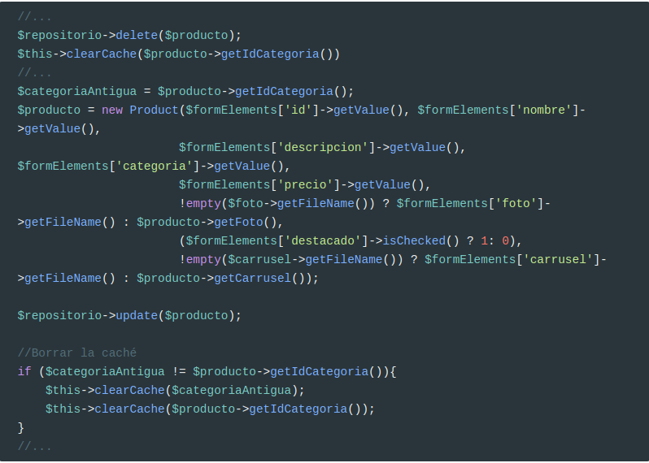
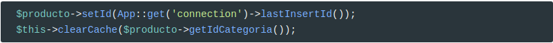
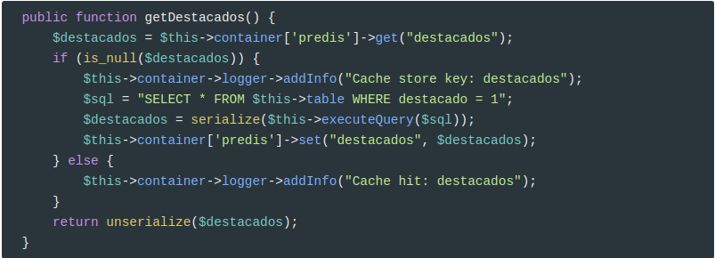
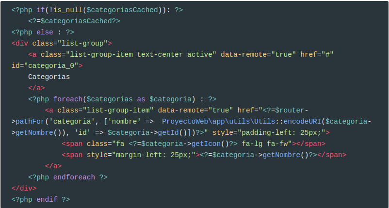
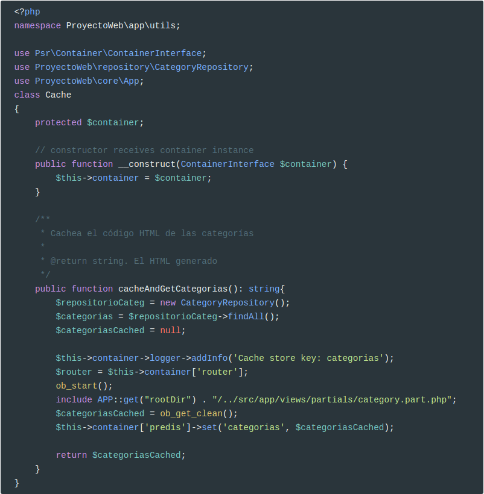
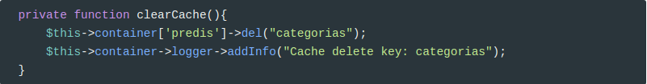

# Usar redis en PHP


> **Redis** ([/ˈrɛdɪs/](https://en.wikipedia.org/wiki/Help:IPA/English);[[4\]](https://en.wikipedia.org/wiki/Redis#cite_note-4)[[5\]](https://en.wikipedia.org/wiki/Redis#cite_note-5) **Remote Dictionary Server**) is an [open-source](https://en.wikipedia.org/wiki/Open-source_software) in-memory data structure project implementing a distributed, [in-memory](https://en.wikipedia.org/wiki/In-memory_database) [key-value](https://en.wikipedia.org/wiki/Key-value_data_store) [database](https://en.wikipedia.org/wiki/Database) with optional [durability](https://en.wikipedia.org/wiki/Durability_(database_systems)). Redis supports different kinds of abstract data structures, such as strings, lists, maps, sets, sorted sets, [hyperloglogs](https://en.wikipedia.org/wiki/HyperLogLog), bitmaps, streams and spatial indexes. The project is mainly developed by Salvatore Sanfilippo and is currently sponsored by [Redis Labs](https://en.wikipedia.org/wiki/Redis_Labs).[[6\]](https://en.wikipedia.org/wiki/Redis#cite_note-network-world-201507-6)

Básicamente es una estructura de datos que se almacena en memoria para tener un acceso ultra rápido y se usa habitualmente para cachear datos.

Es un tipo de base de datos donde se almacenan parejas clave => valor y permiten un acceso prácticamente inmediato a las mismas, independientemente del número de claves que tenga almacenadas.

Para instalar **redis** en **Ubuntu**:

```bash
sudo apt-get install redis-server
```

Si estamos usando **apache**, debemos reiniciar el servidor. Si hemos lanzado el servidor interno de PHP, lo hemos de reiniciar también.

## Procedimiento de cacheo

Para cachear datos, vamos a usar el siguiente procedimiento:

* si la clave está en la caché, devolvemos el valor
* si no lo está la cacheamos y devolvemos el valor
* para invalidar la caché, simplemente borramos la clave. Invalidar significa borrar la clave de la caché para que se deba regenerar.

## Cacheo de datos obtenidos mediante SQL

La página de productos por categorías tiene un paginador. Este paginador necesita conocer cuántos productos existen en una categoría, por lo que es un buen candidato para almacenar el resultado de la consulta en la caché.

El primer paso será instalar **predis** y **monolog**
```
composer require predis/predis
composer require monolog/monolog
```

E inyectarlos en el controlador de servicios de Slim. Estos cambios los hemos de hacer en `public/index.php`

```php
$container['predis'] = new Predis\Client();
$container['logger'] = function($c) {
    $logger = new \Monolog\Logger('cache');
    $file_handler = new \Monolog\Handler\StreamHandler('../logs/app.log');
    $logger->pushHandler($file_handler);
    return $logger;
};

```

Y en `public/admin/index.php`

```php
$container['predis'] = new Predis\Client();
$container['logger'] = function($c) {
    $logger = new \Monolog\Logger('cache');
    //CUIDADO CON LA RUTA!!!
    $file_handler = new \Monolog\Handler\StreamHandler('../../logs/app.log');
    $logger->pushHandler($file_handler);
    return $logger;
};

```

Previamente hemos creado el directorio `/logs` en la raíz de nuestra aplicación. Añadid esta ruta a `.gitignore`

Ahora modificamos `ProductRepository` para inyectarle el contenedor de servicios:

```php
use Psr\Container\ContainerInterface;
class ProductRepository extends QueryBuilder
{
    protected $container;

    // constructor receives container instance
    public function __construct(ContainerInterface $container = null) {
        $this->container = $container;
        parent::__construct('productos', 'Product');
    }
	//....
}    
```

 Modificamos `CategoryController::listado`, para pasar el contenedor al repositorio.

```php
$repositorioProductos = new ProductRepository($this->container);
```

Ya podemos usar **predis** y **monolog** en `ProductRepository`


Los métodos básicos son: `get`, `set` y `del`. Por ejemplo:

```php
$this->container['predis']->get("category-count-$id_categoria");
```

Si el ID categoría es `1`, devolverá el valor de la clave `category-count-1`, si existe o **null** en caso contrario.

```php
$this->container['predis']->set("category-count-$id_categoria", $countCached);
```

En este caso, estamos fijando la clave`category-count-1` con el valor devuelto por la consulta.

### Invalidar caché

Pero ahora, ¿qué pasa si añadimos un producto en una categoría, le cambiamos la categoría a uno existente o borramos un producto?. De alguna forma hemos de invalidar la caché para que se vuelva a regenerar.

Para ello, modificamos `admin\ProductController` creando un método que limpie la caché:



En este caso, usamos el método `del()` pasándole la clave a eliminar.

Y ahora lo usamos al añadir, modificar y eliminar:

En `edit()`



Y en `add()`



Si observamos el `log`, veremos cómo funciona la caché:

En el siguiente caso, se ha hecho la consulta SQL y se ha guardado la clave.

```
[2019-01-14 10:36:20] cache.INFO: Cache store key: category-count-1 [] []
```

En este caso, se ha obtenido el contador de la categoría de la caché.

```
[2019-01-14 10:36:26] cache.INFO: Cache hit: category-count-1 [] []
```

Y en este otro caso, se ha eliminado el contador de la categoría 1

```
[2019-01-14 10:36:04] cache.INFO: Cache delete key: category-count-1 [] []
```

Por lo que la siguiente vez, se volverá a calcular y guardar en caché.


## Cachear objetos

Vamos a cachear los objetos `Product` devueltos por `getDestacados()`. En este caso lo que vamos a guardar en la caché son los objetos **serializados**. 

Según la [Wikipedia](https://en.wikipedia.org/wiki/Serialization):

> In [computer science](https://en.wikipedia.org/wiki/Computer_science), in the context of data storage, **serialization** (or serialisation) is the process of translating [data structures](https://en.wikipedia.org/wiki/Data_structure) or [object](https://en.wikipedia.org/wiki/Object_(computer_science)) state into a format that can be stored (for example, in a [file](https://en.wikipedia.org/wiki/Computer_file) or memory [buffer](https://en.wikipedia.org/wiki/Data_buffer)) or transmitted (for example, across a [network](https://en.wikipedia.org/wiki/Computer_network) connection link) and reconstructed later (possibly in a different computer environment).[[1\]](https://en.wikipedia.org/wiki/Serialization#cite_note-1)
> When the resulting series of bits is reread according to the serialization format, it can be used to create a semantically identical clone of the original object. For many complex objects, such as those that make extensive use of [references](https://en.wikipedia.org/wiki/Reference_(computer_science)), this process is not straightforward. Serialization of object-oriented [objects](https://en.wikipedia.org/wiki/Object_(computer_science)) does not include any of their associated [methods](https://en.wikipedia.org/wiki/Method_(computer_science)) with which they were previously linked.

Y los devolvemos **deserializados**.

Es muy sencillo:



Modificamos `PageController::home` para pasarle el contenedor de servicios a `ProductRepository`:

```php
$repositorio = new ProductRepository($this->container);
```

Y ya lo tenemos cacheado :)

### Invalidar caché

Ahora cada vez que un producto pase de destacado a no destacado, o viceversa hemos de invalidar esta clave en la caché. También debemos invalidar caché cuando eliminemos un producto que era destacado y cuando añadamos un producto destacado. Y siempre que modifiquemos un producto destacado porque pueden haber variado los datos (precio, nombre, ...).

Por tanto, en `ProductController::edit`

```diff
//Formato diff
@@ -40,6 +40,12 @@
         $this->container['predis']->del("category-count-$id_categoria");
         $this->container->logger->addInfo("Cache delete key: category-count-$id_categoria");
     }
+
+    private function clearCacheDestacados(){
+        $this->container['predis']->del("destacados");
+        $this->container->logger->addInfo("Cache delete key: destacados");
+    }
+
     
     public function home($request, $response, $args) {
         //Cuidado, al hacer redirección el mensaje flash se ha borrado en index.php
@@ -231,6 +237,9 @@
                 try {
                     $repositorio->delete($producto);
                     $this->clearCache($producto->getIdCategoria());
+                    if ($producto->getDestacado() == 1) {
+                        $this->clearCacheDestacados();
+                    }
                     $this->container->flash->addMessage('formInfo', 'Producto eliminado correctamente');
                     return $response->withRedirect($this->container->router->pathFor('productos'), 303);
                 }catch(QueryException $qe) {
@@ -261,6 +270,7 @@
                         ->toFile(APP::get('rootDir') . Product::RUTA_IMAGENES_CARRUSEL . $carrusel->getFileName());
                     }
                     $categoriaAntigua = $producto->getIdCategoria(); 
+                    $destacadoAntiguo = $producto->getDestacado(); 
                     $producto = new Product($formElements['id']->getValue(), $formElements['nombre']->getValue(), 
                                            $formElements['descripcion']->getValue(), $formElements['categoria']->getValue(),
                                            $formElements['precio']->getValue(), 
@@ -275,7 +285,11 @@
                         $this->clearCache($categoriaAntigua);
                         $this->clearCache($producto->getIdCategoria());
                     }
-                    
+                    //Si es destacado SIEMPRE borramos la caché porque puede ser que haya cambiado el nombre,
+                    //el precio, la descripción o la foto.
+                    if (($producto->getDestacado() == 1) || ($destacadoAntiguo != $producto->getDestacado())) {
+                        $this->clearCacheDestacados();
+                    }
                     $form->reset();
                     $this->container->flash->addMessage('formInfo', 'Producto guardado correctamente');
                     return $response->withRedirect($this->container->router->pathFor('edit-product', ['id' => $formElements['id']->getValue()]), 303);
@@ -341,6 +355,9 @@
                 $repositorio->save($producto);
                 $producto->setId(App::get('connection')->lastInsertId());
                 $this->clearCache($producto->getIdCategoria());
+                if ($producto->getDestacado() == 1) {
+                    $this->clearCacheDestacados();
+                }
                 $form->reset();
                 $this->container->flash->addMessage('formInfo', 'Producto guardado correctamente');
                 return $response->withRedirect($this->container->router->pathFor('edit-product', ['id' => $producto->getId()]), 303);

```


## Cacheo HTML

En este caso, pretendemos cachear código HTML generado mediante PHP. Por ejemplo, vamos a cachear el menú de categorías.

Este caso es un poco diferente y más complejo, porque hemos de generar código HTML desde el `partial category.part.php`

El código HTML cacheado lo guardamos en la variable `$categoriasCached` que le pasamos a la plantilla, de tal forma que si esta variable está informada, simplemente hace un `echo` y si no lo está, genera el código HTML.



Y ahora modificamos `PageController::home`


Vamos a explicar los cambios introducidos:

* Para renderizar el contenido de la plantilla hacemos lo siguiente:

  ```php
  ob_start();
  include APP::get("rootDir") . "/../src/app/views/partials/category.part.php";
  $categoriasCached = ob_get_clean();
  $this->container['predis']->set('categorias', $categoriasCached);
  ```

  * `ob_start();` impide que se envía la salida al servidor web (apache) y lo guarda en un buffer
  * `include`  procesa el código PHP de la plantilla
  * `$categoriasCached = ob_get_clean();`guarda el contenido del buffer en la variable `$categoriasCached`

* Como la plantilla usa dos variables: `$router` y `$categorias`, las hemos de informar antes de hacer el `include`. 

* Finalmente, a `render()` le pasamos también la variable `$categoriasCached`

Este mismo cambio se debe hacer en `CategoryController::listado` y en `ProductController::ficha` 

Para seguir el principio **DRY** (Don't Repeat Yourself), vamos a mover este código a una nueva clase llamada `ProyectoWeb\app\utils\Cache` que también inyectaremos al contenedor de servicios.



Modificamos `index.php` para inyectar esta nueva clase al contenedor de servicios:

```php
//...
use ProyectoWeb\app\utils\Cache;
//...
$container['cache'] = new Cache($container);
```

Y ahora modificamos los controladores:

`PageController`

```php
public function home($request, $response, $args) {
    $title = "Inicio";
    
    $repositorio = new ProductRepository($this->container);
    
    $carrusel = $repositorio->getCarrusel();

    $destacados = $repositorio->getDestacados();

    $novedades = $repositorio->getNovedades();
    $categoriasCached =$this->container['predis']->get('categorias');
    if (is_null($categoriasCached)) {
        $categoriasCached = $this->container['cache']->cacheAndGetCategorias();
    }else{
        $this->container->logger->addInfo('Cache hit: categorias');
    }

    return $this->container->renderer->render($response, "index.view.php", compact('title', 'categorias', 'categoriasCached', 'carrusel', 'destacados', 'novedades'));
    
}
```
`ProductController`

```php
public function ficha($request, $response, $args) {
    extract($args);

    $repositorio = new ProductRepository();
    try {
        $producto = $repositorio->findById($id);
    }catch(NotFoundException $nfe) {
        return $response->write("Producto no encontrado");
    }
    $title = $producto->getNombre();
    $relacionados = $repositorio->getRelacionados($producto->getId(), $producto->getIdCategoria());
    
    $categoriasCached =$this->container['predis']->get('categorias');
    if (is_null($categoriasCached)) {
        $categoriasCached = $this->container['cache']->cacheAndGetCategorias();
    }else{
        $this->container->logger->addInfo('Cache hit: categorias');
    }
    
    return $this->container->renderer->render($response, "product.view.php", compact('title', 'categorias', 'categoriasCached', 'producto', 'relacionados'));
    
}
```

Y `CategoryController`

```php
public function listado($request, $response, $args) {
    extract($args);
   
    $repositorio = new CategoryRepository();
    try {
        $categoriaActual = $repositorio->findById($id);
    }catch(NotFoundException $nfe) {
        return $response->write("Categoría no encontrada");
    }
    $title = $categoriaActual->getNombre();
  
    $repositorioProductos = new ProductRepository($this->container);
    
    //Datos para el paginador
    $currentPage = ($currentPage ?? 1);
    $totalItems = $repositorioProductos->getCountByCategory($categoriaActual->getId());
    $itemsPerPage = App::get('config')['itemsPerPage'];
    $urlPattern = $this->container->router->pathFor('categoria', 
            ['nombre' =>  \ProyectoWeb\app\utils\Utils::encodeURI($categoriaActual->getNombre()), 
             'id' => $categoriaActual->getId()]) . '/page/(:num)';
    $paginator = new Paginator($totalItems, $itemsPerPage, $currentPage, $urlPattern);
    $productos = $repositorioProductos->getByCategory($categoriaActual->getId(), $itemsPerPage, $currentPage);
    
    $categoriasCached =$this->container['predis']->get('categorias');
    if (is_null($categoriasCached)) {
        $categoriasCached = $this->container['cache']->cacheAndGetCategorias();
    }else{
        $this->container->logger->addInfo('Cache hit: categorias');
    }
    
    return $this->container->renderer->render($response, "categoria.view.php", compact('title', 'categorias', 'categoriasCached',
    'categoriaActual', 'productos', 'paginator'));
    
}
```

### Invalidar caché

Ahora hemos de invalidar la caché en `admin/CategoryController`



Y usamos el método cada vez que añadimos, modificamos o borramos una categoría.


------

**Credits.**

Víctor Ponz victorponz@gmail.com

Este material está licenciado bajo una licencia [Creative Commons, Attribution-NonCommercial-ShareAlike](https://creativecommons.org/licenses/by-nc-sa/3.0/)


