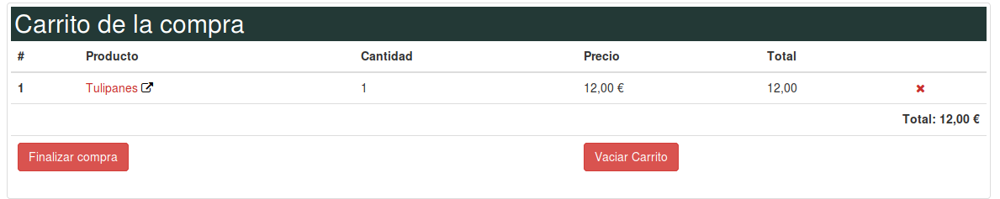
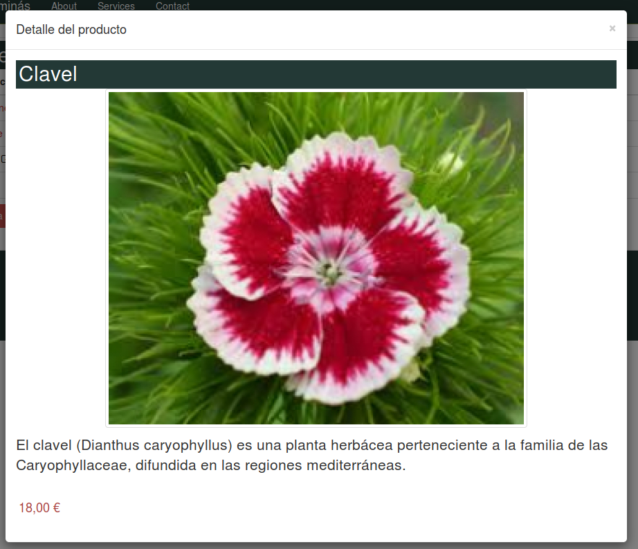
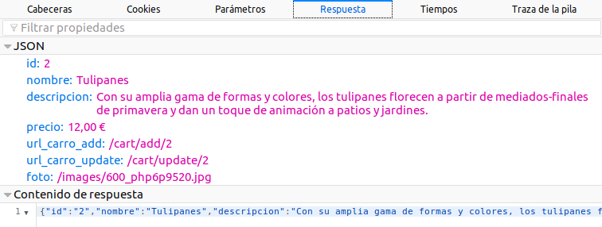
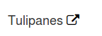
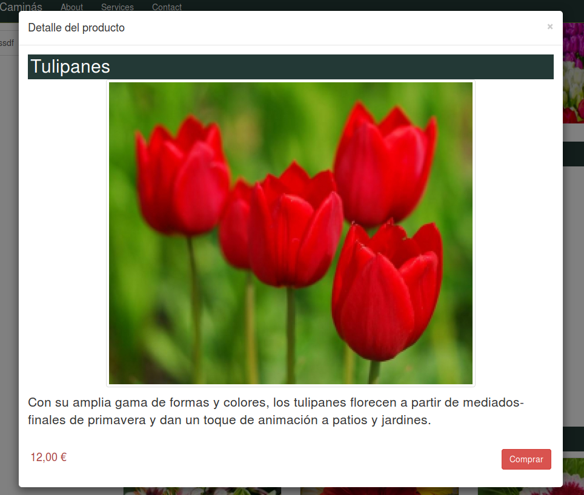

# Carga asíncrona 


## Modal para el producto mediante JSON

Una de las formas para cargar datos asíncronamente es mediante **ajax** realizando una petición de datos **json** \(también es válido para xml)

Una vez traídos los datos json sólo hemos de actualizar el DOM con estos nuevos datos.

Para llevar a cabo este efecto hacen falta tres cosas:

1. Una url que nos devuelva la información json
2. Una ventana modal para mostrar los datos
3. Código javascript que enlace los eventos.
4. Un elemento HTML al que añadimos el evento.

Vamos a implementar esta funcionalidad en la página del carro.






### Ruta que nos devuelva la información

Hace falta una url con la información del producto. Pero no nos sirve la ruta normal

```php
$app->get('/producto/{nombre}/{id:[0-9]+}', ProductController::class . ':ficha')->setName("ficha");
```

porque esta carga toda la información del producto \(además de los productos relacionados\) y nosotros sólo queremos la versión json del mismo.

Así que vamos a añadirle un parámetro opcional a la ruta.

```php
$app->get('/producto/{nombre}/{id:[0-9]+}[/{format}]', ProductController::class . ':ficha')->setName("ficha");
```

De esta forma, para pedir el producto en formato json, sólo hay que añadir al final de la ruta `/json`

Por ejemplo:

```
http://127.0.0.1:8080/producto/tulipanes/2/json
```

### Controlador

Y modificamos el controlador:

```diff
 class ProductController
 {
     protected $container;
@@ -19,10 +20,26 @@ class ProductController
     }
     public function ficha($request, $response, $args) {
         extract($args);
+        $format = ($format ?? 'html');
+        if (($format != "html") && ($format != 'json')) {
+            return $response->withStatus(404)
+            ->withHeader('Content-Type', 'text/html')
+            ->write('Page not found');
+        }

         $repositorio = new ProductRepository();
         try {
             $producto = $repositorio->findById($id);
+            if ($format == 'json'){
+                $json = json_encode(array("id" =>  $producto->getId(),
+                                          "nombre" => $producto->getNombre(),
+                                          "descripcion" => $producto->getDescripcion(),
+                                          "precio" => number_format($producto->getPrecio(), 2, ',', ' ') . " €",
+                                          "url-carro-add" => $this->container->router->pathFor('cart-add', ['id' => $producto->getId()]),
+                                          "url-carro-update" => $this->container->router->pathFor('cart-update', ['id' => $producto->getId()]),
+                                          "foto" => $this->container->request->getUri()->getBasePath() . Product::RUTA_IMAGENES . '600_' . $producto->getFoto(),));
+                return $response->getBody()->write($json);
+            }
         }catch(NotFoundException $nfe) {
             return $response->write("Producto no encontrado");
         }
```

Esta es la respuesta del servidor



Ahora nos falta enlazarlo para que muestre los datos en una ventana modal.

### Elemento DOM

Modificamos el carro `(cart.part.php)` para que muestre un icono nuevo para mostrar la ventana modal:

```diff
@@ -23,7 +23,7 @@
         foreach ($lineas as $producto) :?>
       <tr>
         <th scope="row"><?=$i++;?></th>
-        <td><a href="<?=$router->pathFor('ficha', ['nombre' =>  ProyectoWeb\app\utils\Utils::encodeURI($producto['producto']->getNombre()), 'id' => $producto['producto']->getId()])?>"><?= $producto['producto']->getNombre()?></a></td>
+        <td><a class="open-modal" href="<?=$router->pathFor('ficha', ['nombre' =>  ProyectoWeb\app\utils\Utils::encodeURI($producto['producto']->getNombre()), 'id' => $producto['producto']->getId()])?>"><?= $producto['producto']->getNombre()?>  <span style='color:#000' class='fa fa-external-link'></span></a></td>
         <td><?=$producto['cantidad']?></td>
         <td><?= number_format($producto['producto']->getPrecio(), 2, ',', ' ')?> €</td>
         <td><?= number_format($producto['total'], 2, ',', ' ')?></td>
```

Fijaos que hemos añadido una clase css al enlace (`open-modal`) y hemos añadido un icono de bootstrap.

Esta clase la usamos como selector css en javascript.

### Ventana modal

Esta es la plantilla que usamos para mostrar los ventana modal, guardada en `partials/modal-json-producto.php`. Esta ventana modal es una plantilla en la que cada elemento será sustituido por los datos devueltos pos json.

Por ejemplo, en el elemento DOM seleccionado mediante el selector css `.subtitle`, pondremos el dato `nombre` devuelto por JSON.

```html
<div class="modal fade" id="modalJsonProducto" tabindex="-1" role="dialog" aria-labelledby="myModalLabel">
  <div class="modal-dialog modal-lg" role="document">
    <div class="modal-content">
      <div class="modal-header">
        <button type="button" class="close" data-dismiss="modal" aria-label="Close"><span aria-hidden="true">×</span></button>
        <h4 class="modal-title" id="myModalLabel">Detalle del producto</h4>
      </div>
      <div class="modal-body">
        <div id="ficha-producto" class="row">
          <h2 class="subtitle"></h2>
          
          <div class="caption">
            <p class="lead"></p>
          </div>
          <h4 class="pull-right"><span class="text text-danger"></span></h4>
        </div>
      </div>
    </div>
  </div>
</div>
```

Y la incluimos sólo en la vista del carro:

```php
<?php
  include __DIR__ . "/partials/inicio-doc.part.php";
  include __DIR__ . "/partials/cart.part.php";
  include __DIR__ . "/partials/modal-json-producto.part.php";
  include __DIR__ . "/partials/fin-doc.part.php";
?>
```

Modificamos `CartController` para que pase una nueva variable, `attachModalInfoJson`,  a la plantilla:

```diff
@@ -53,7 +53,8 @@ class CartController
             $lineas = $items['productos'];
             $total = $items['total'];
         }
-        return $this->container->renderer->render($response, "cart.view.php", compact('title', 'header', 'checkout', 'lineas', 'total', 'withCategories'));
+        $attachModalInfoJson = true;
+        return $this->container->renderer->render($response, "cart.view.php", compact('title', 'header', 'checkout', 'lineas', 'total', 'withCategories', 'attachModalInfoJson'));
     }

     public function add($request, $response, $args) {
```

Y modificamos `fin-doc.part.php` para que ejecute el javascript que carga los datos:

```diff
@@ -29,6 +29,16 @@
 <?php endif ?>
+<?php if(($attachModalInfoJson ?? false)):?>
+<script>
+attachModalInfoJson();
+</script>
+<?php endif ?>
```

Ya sólo nos queda enlazarlo todo mediante javascript:

<script src="https://gist.github.com/victorponz/a7c54d3fdb5feac49dc55d3206f59bea.js"></script>

> **IMPORTANTE**
>
>Ahora cuando mostremos la ventana modal del carro, aparecerá el nombre de la siguiente forma:
>
>
>
>Para eliminar el icono de **bootstrap**, hay que modificar `app.js`, cambiando:
>
>```javascript
> cartElements.desc.html(desc.html());
>```
>
>por
>
>```javascript
> cartElements.desc.html(desc.text());
>```


## Modal para el producto mediante dom

Otra forma para mostrar ventanas modales es realizando una petición ajax que nos devuelva un código HTML.

Este HTML se inyecta en el body de la ventana modal.



Para llevar a cabo este efecto hacen falta tres cosas:

1. Una url que nos devuelva la información en formato HTML

2. Una ventana modal para mostrar los datos

3. Código javascript que enlace los eventos.

### Ruta

En este caso nos sirve la misma ruta que antes:

```php
$app->get('/producto/{nombre}/{id:[0-9]+}[/{format}]', ProductController::class . ':ficha')->setName("ficha");
```

Añadimos el parámetro `exclusive` a la ruta:

```
http://127.0.0.1:8080/producto/tulipanes/2/exclusive
```

Que nos devolverá sólo el HTML de la ficha del producto:

```html
<div id="ficha-producto" class="row">
  <h2 class="subtitle">Tulipanes</h2>
  
  <div class="caption">
    <p class="lead">Con su amplia gama de formas y colores, los tulipanes florecen a partir de mediados-finales de primavera y dan un toque de animación a patios y jardines.<p>
  </div>
  <h4 class="pull-right"><span class="text text-danger">12,00 €</span></h4>
  <a href="/cart/add/2" data-href-update='/cart/update/2' class="btn btn-danger">Comprar</a>  
</div>
```

### Ventana modal

Esta es la plantilla para esta ventana modal, `modal-dom-producto.part.php`:

```html
<div class="modal fade" id="modalDetalleProducto" tabindex="-1" role="dialog" aria-labelledby="myModalLabel">
  <div class="modal-dialog modal-lg" role="document">
    <div class="modal-content">
      <div class="modal-header">
        <button type="button" class="close" data-dismiss="modal" aria-label="Close"><span aria-hidden="true">&times;</span></button>
        <h4 class="modal-title" id="myModalLabel">Detalle del producto</h4>
      </div>
      <div class="modal-body" >
        <div id='data-container'></div>
      </div>
    </div>
  </div>
</div>
```

Cuando responda la petición JSON, inyectaremos el HTML devuelto en el elemento `data-container`

Añadimos un icono para mostrar la ventana modal, en `thumbnail-producto.part.php`, igual que hicimos en `cart.part.php`

```php+HTML
<a class='open-modal' href='<?=$router->pathFor('ficha', ['nombre' =>  ProyectoWeb\app\utils\Utils::encodeURI($producto->getNombre()), 'id' => $producto->getId()])?>'><?= $producto->getNombre()?> <span style='color:#000' class='fa fa-external-link'></span></a>
```

Modificamos la vista `index.view.php`, para incluir el partial:

```php
<?php
  include __DIR__ . "/partials/inicio-doc.part.php";
  include __DIR__ . "/partials/carrusel.part.php";
  include __DIR__ . "/partials/destacados.part.php";
  include __DIR__ . "/partials/novedades.part.php";
  include __DIR__ . "/partials/modal-carro.part.php";
  include __DIR__ . "/partials/modal-dom-producto.part.php";
  include __DIR__ . "/partials/mask.part.php";
  include __DIR__ . "/partials/fin-doc.part.php";
?>
```

### Controlador

Modificamos `ProductController::ficha`

```diff
     public function ficha($request, $response, $args) {
         extract($args);
         $format = ($format ?? 'html');
-        if (($format != "html") && ($format != 'json')) {
+        if (($format != "html") && ($format != 'json') && ($format != 'exclusive')) {
             return $response->withStatus(404)
             ->withHeader('Content-Type', 'text/html')
             ->write('Page not found');
@@ -39,6 +39,8 @@ class ProductController
                                           "url_carro_update" => $this->container->router->pathFor('cart-update', ['id' => $producto->getId()]),
                                           "foto" => $this->container->request->getUri()->getBasePath() . Product::RUTA_IMAGENES . '600_' . $producto->getFoto(),));
                 return $response->getBody()->write($json);
+            } else if ($format == 'exclusive') {
+                return $this->container->renderer->render($response, "partials/ficha.part.php", compact('producto'));
             }
         }catch(NotFoundException $nfe) {
             return $response->write("Producto no encontrado");
@@ -53,7 +55,8 @@ class ProductController
             $this->co
```

### Javascript

Ya sólo nos falta enlazarlo todo con javascript:

<script src="https://gist.github.com/victorponz/dfa678f0c415ffd88900669e776faccc.js"></script>

Modificamos `PageController` para que le indique a la vista que llame a la función javascript `attachModalInfo`

```diff
         }else{
             $this->container->logger->addInfo('Cache hit: categorias');
         }
-
-        return $this->container->renderer->render($response, "index.view.php", compact('title', 'categorias', 'categoriasCached', 'carrusel', 'destacados', 'novedades'));
+        $attachModalInfo = true;
+        return $this->container->renderer->render($response, "index.view.php", compact('title', 'categorias', 'categoriasCached', 'carrusel', 'destacados', 'novedades', 'attachModalInfo'));

    }
```

Y modificamos `fin-doc.part.php`, para que llame a la función `attachModalInfo`

```php
<?php if(($attachModalInfo ?? false)):?>
<script>
attachModalInfo();
</script>
<?php endif ?>
```

## Ficha del producto

Vamos a usar la técnica de carga asíncrona por JSON en la página de información de producto al hacer clic en cualquier producto relacionado.


Para llevar a cabo este efecto hacen falta tres cosas:

1. Una máscara para informar al usuario de que estamos cargando datos
2. Una url que nos devuelva la información json
3. Código javascript que enlace los eventos.

### Máscara

Esta máscara ya debe estar creada en `partials/mask.part.php` porque la usamos para actualizar el carro.

```html
  <div id="mask" style="position: fixed; width: 100%; height: 100%; top: 0px; left: 0px; z-index: 1040;
  background-color: white;  opacity: .9; display:none">
    <div class="alert alert-info" role="alert" style='position: absolute;  top: 30%;  left: 50%;  transform: translate(-30%, -50%);'>
        /loading_animation.gif'> Cargando ...
    </div>
  </div>
```

### Ruta que nos devuelva la información

La segunda parte es una url con la información del producto. Esta ruta es la misma que hemos usado previamente en el ejemplo de la página del carro.

```php
$app->get('/producto/{nombre}/{id:[0-9]+}[/{format}]', ProductController::class . ':ficha')->setName("ficha");
```

De esta forma, para pedir el producto en formato json, sólo hay que añadir al final de la ruta `/json`

El controlador es el mismo también.

### Javascript

Ahora ya solo falta enlazar los elementos dom para que al hacer clic en el thumbnail del producto, cargue los datos asíncronamente.  

Siempre que carguemos datos asíncronamente, nos hemos de plantear si nos interesa mantener el historial de la página.  

Cuando cargamos datos por ajax, el _history_ del navegador no se modifica. Esto tiene graves implicaciones de usabilidad. Imaginad que cargo la primera página de producto y luego voy haciendo clic otro producto. Como no se ha cambiado la url, cuando el usuario haga clic en el botón anterior del navegador, no volverá al producto anterior sino a la página en la que estuviera antes de visitar por primera vez la página de productos. Además, pensad que un usuario ha visitado el producto 2 y decide guardarse la url en favoritos o compartirla con alguien: realmente no se ha guardado el enlace al producto 2, sino al primer producto!!  

Para comprobar este efecto indeseable, comentad la línea que hace `pushState`.  

Para corregir este defecto, se usa el método pushState del navegador \(sólo es válido en navegadores compatibles con HTML5\).

Además, **no pongáis nunca en HTML la url con /json** porque cuando Google rastree nuestra página seguirá este enlace y no queremos que lo haga con ese estado. Por tanto, es importante hacerlo siempre en javascript.

#### Cómo funciona pushState

El navegador mantiene una estructura para guardar el history. Cada vez que llamamos a `pushState(data, title, url)` almacena estos datos. Por ejemplo, si llamamos a pushState\("datos1", null, pagina1.php\) y pushState\("datos2", null, pagina2.php\), este será el contenido de dicha estructura del navegador.

| data | title | url |
| :--- | :--- | :--- |
| datos1 | null | pagina1.php |
| datos2 | null | pagina2.php |

Cuando el usuario visita una de estas páginas mediante los botones del historial `Siguiente` o `Anterior`, el navegador llama al evento `popstate` y le pasa como parámetro los datos guardados para esa url.  
Por ejemplo, cuando el usuario visite con los botones del historial la página `pagina2.php`, el evento contendrá el valor `"datos2"` en el campo `state`. Si por el contrario, visita la página `pagina1.php,` el evento contendrá el valor `"datos1"`

Este javascript debéis añadirlo a `app.js`

<script src="https://gist.github.com/victorponz/348cef720a388be5f6504c2e29d973c9.js"></script>

### **Importante**  

Este código javascript debe ir después de la carga de jQuery y de bootstrap, es decir en  `fin-doc.part.php`  
Pero si lo ponemos tal cual en este archivo, se cargará en todas las páginas y no queremos que esto ocurra.  Así que nos definimos una nueva variable en el controlador ProductController:

```php
$loadProductoJson = true;
return $this->container->renderer->render($response, "product.view.php", compact('title', 'categorias', 'categoriasCached', 'producto', 'relacionados', 'loadProductoJson'));

```

Y modificamos `fin-doc.part.php` 

```diff
@@ -24,6 +24,11 @@
 <!-- Bootstrap Core JavaScript -->
 <script src="<?=$basePath;?>/js/bootstrap.min.js"></script>
 <script src="<?=$basePath;?>/js/app.js"></script>
+<?php if(($loadProductoJson ?? false)):?>
+<script>
+loadProductoJson();
+</script>
+<?php endif ?>
 </body>
```

### Mejoras

Como podéis observar, ahora ya no cambian los productos relacionados.

Así que os lo dejo como mejora.

------

**Credits.**

Víctor Ponz victorponz@gmail.com

Este material está licenciado bajo una licencia [Creative Commons, Attribution-NonCommercial-ShareAlike](https://creativecommons.org/licenses/by-nc-sa/3.0/)


