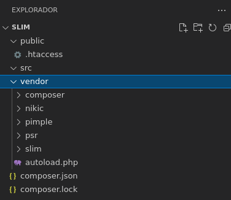
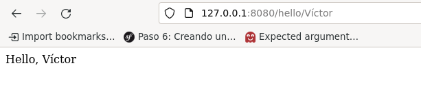
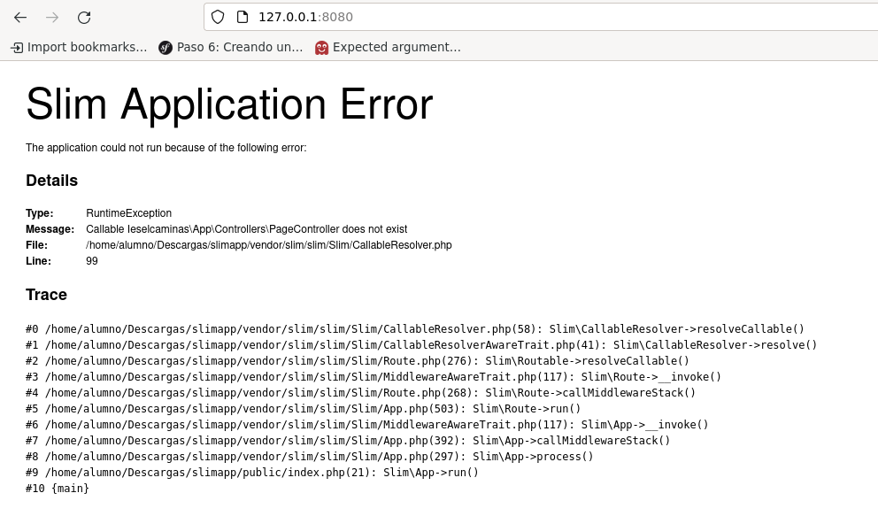
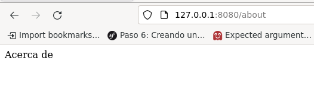

# 1 SLIM Microframework

En esta práctica vamos a usar el **controlador frontal** que proporciona el **microframework** [Slim](https://www.slimframework.com/).

Según la [Wikipedia](https://en.wikipedia.org/wiki/Front_controller):

>  The **front controller** [software design pattern](https://en.wikipedia.org/wiki/Software_design_pattern) is listed in several pattern catalogs and related to the design of web applications. It is "a [controller](https://en.wikipedia.org/wiki/Model%E2%80%93view%E2%80%93controller) that handles all requests for a [website](https://en.wikipedia.org/wiki/Website)",[[1\]](https://en.wikipedia.org/wiki/Front_controller#cite_note-:0-1) which is a useful structure for web application developers to achieve the flexibility and reuse without code redundancy.

Hasta ahora hemos creado un script php físico para cada una de las secciones de nuestra aplicación. En cada una de estos scripts realizamos siempre una serie de tareas comunes: iniciar sesión, conectarnos con la base de datos, ... Pero lo habitual en una aplicación real es usar un controlador frontal

## 1.2 Composer 

Para trabajar con Slim, necesitamos usar **composer** en nuestro proyecto. 

> **Composer** es un [sistema de gestión de paquetes](https://es.wikipedia.org/wiki/Sistema_de_gestión_de_paquetes) para programar en [PHP](https://es.wikipedia.org/wiki/PHP) el cual provee los formatos estándar necesarios para manejar dependencias y [librerías](https://es.wikipedia.org/wiki/Biblioteca_(informática)) de PHP. Fue desarrollado por Nils Adermann y Jordi Boggiano quienes  continúan dirigiendo el proyecto. Ambos comenzaron el desarrollo en  abril de 2011 y en marzo de 2012 presentaron la primera versión.[1](https://es.wikipedia.org/wiki/Composer#cite_note-ird-1) Composer está inspirado en [Node.js](https://es.wikipedia.org/wiki/Node.js), [npm](https://es.wikipedia.org/wiki/Npm) y en Bundler [Ruby](https://es.wikipedia.org/wiki/Ruby).[3](https://es.wikipedia.org/wiki/Composer#cite_note-3)
>
> Composer trabaja e instala dependencias o librerías desde la [línea de comandos](https://es.wikipedia.org/wiki/Interfaz_de_línea_de_comandos). También permite al usuario instalar las aplicaciones PHP que estén disponibles en el *"Packagist"*, [4](https://es.wikipedia.org/wiki/Composer#cite_note-4) el repositorio principal que contiene todos los paquetes disponibles.  También dispone de capacidad de auto-descarga para las librerías  necesarias que se especifiquen en la información de arranque para así  facilitar el uso del código de terceros.        

Para [instalarlo](https://getcomposer.org/download/), ejecuta los siguientes comandos:

```bash
php -r "copy('https://getcomposer.org/installer', 'composer-setup.php');"
php -r "if (hash_file('sha384', 'composer-setup.php') === '906a84df04cea2aa72f40b5f787e49f22d4c2f19492ac310e8cba5b96ac8b64115ac402c8cd292b8a03482574915d1a8') { echo 'Installer verified'; } else { echo 'Installer corrupt'; unlink('composer-setup.php'); } echo PHP_EOL;"
php composer-setup.php
php -r "unlink('composer-setup.php');"
```

Esto descarga `composer` y llama al instalador. Como resultado genera un archivo llamado `composer.phar` en el directorio donde hayamos lanzado la instalación.

Para poder usarlo en la línea de comandos sin tener que especificar la ruta al ejecutable, vamos a moverlo a la carpeta donde se alojan los ejecutables en linux (`/usr/local/bin/`)

```bash
sudo mv composer.phar /usr/local/bin/composer
```

## 1.3 Creación de una aplicación

**Antes de empezar, crea un directorio vacío para crear una aplicación de ejemplo**. Dentro de aquí crea dos carpetas una llamada `public` y otra llamada `src`. La carpeta `public` contendrá todos los archivos a los que se pueda acceder desde Internet y la carpeta `src` mantendrá los controladores, entidades, repositorios, etc.

Lo habitual en una aplicación web es tener un directorio llamado `public` de donde cuelgan todos los archivos que son accesibles con un cliente web.

Todos l**os demás archivos no deben estar accesibles**, por lo que estarán en un directorio llamado `src` a la misma altura que `public`.

## 1.4 Controlador frontal

El controlador frontal se refiere a un **patrón de diseño** en el que un solo componente de la aplicación es responsable de manejar todas las solicitudes a otras partes de una aplicación. Centraliza la funcionalidad común que necesita el resto de su aplicación. Las plantillas, el enrutamiento y la seguridad son ejemplos comunes de la funcionalidad del controlador frontal. El beneficio de usar este patrón de diseño es que cuando el comportamiento de estas funciones necesita cambiar, solo una pequeña parte de la aplicación necesita ser modificada. De esta forma todo el código común se implementa en este controlador frontal que además es el encargado de cargar el script encargado de procesar la petición del usuario.

Para ello necesitamos que todas las solicitudes del usuario pasen por el controlador frontal. 

Necesitamos un fichero `.htaccess`  (fijaos en el **.** inicial) con reglas de reescritura. Este archivo debe estar dentro de la **carpeta `public`**

```
<IfModule mod_rewrite.c>
    Options -MultiViews
    RewriteEngine On
    RewriteCond %{REQUEST_FILENAME} !-f
    RewriteCond %{REQUEST_FILENAME} !-d
    RewriteRule ^(.*)$ index.php [QSA,L]
</IfModule>
```

Las directivas `RewriteCond %{REQUEST_FILENAME} !-f` y `RewriteCond %{REQUEST_FILENAME} !-d` se utilizan para que la regla `RewriteRule ^(.*)$ index.php [QSA,L]` sólo se aplique cuando no se pide un fichero (f) o un directorio (d) existente. Y esta regla lo que hace es enviar todo al controlador frontal pasándole además cualquier parámetro en el querystring. 

Si alguien tiene interés en saber qué significa `MultiViews` y `QSA`, puede consultar las siguientes páginas:

* https://stackoverflow.com/questions/25423141/what-exactly-does-the-the-multiviews-options-in-htaccess
* https://wiki.apache.org/httpd/RewriteFlags/QSA

## 1.5 Instalar Slim

Para instalarlo, usamos **composer** en la raíz de nuestro proyecto:

```bash
composer require slim/slim:3.*
```

Al realizar esta instalación la estructura de directorios quedará como sigue:



Ha aparecido un directorio llamado `vendor` donde hay varias subcarpetas, entre ellas Slim. Cada vez que instalemos un paquete con **composer** aparecerá aquí.

Un archivo llamado `composer.json` con el siguiente contenido:

```json
{
    "require": {
        "slim/slim": "3.*"
    }
}
```

Este archivo indica que nuestra aplicación requiere el uso de Slim

Y otro archivo llamado `composer.lock` que tiene todas las dependencias de Slim. 

## 1.6 Uso de Slim

Usarlo dentro de nuestra aplicación es bien sencillo. **Crea**  un archivo `index.php`  dentro de `public` con el siguiente contenido:

```php
<?php
use \Psr\Http\Message\ServerRequestInterface as Request;
use \Psr\Http\Message\ResponseInterface as Response;

require __DIR__ . '/../vendor/autoload.php';

$config = [
    'settings' => [
        'displayErrorDetails' => true
    ],
];
$app = new \Slim\App($config);
$app->get('/hello/{name}', function (Request $request, Response $response, array $args) {
    $name = $args['name'];
    $response->getBody()->write("Hello, $name");

    return $response;
});
$app->run();
```

Como podéis observar Slim funciona **asociando un `path` con una función**, anónima en este ejemplo. Cuando el usuario visita la página `/hello/víctor`, se encarga de llamar a dicha función pasando como parámetro la variable `$name`.

Ahora lanza el servidor de PHP pero debes estar **dentro de la carpeta `public`**. Si visitas la página [http://127.0.0.1:8080/hello/Víctor](http://127.0.0.1:8080/hello/V%C3%ADctor) aparecerá un saludo de bienvenida.



Además, como parámetros a dicha función, siempre le **inyecta** automáticamente las dependencias `Request` y `Response` que representan a la petición del cliente y al respuesta del servidor, respectivamente.

## 1.7 Clases Controladores

Lo habitual es tener las funciones asociadas con una ruta o rutas en un **Clase Controlador** propia. 

Veamos qué es esto de las Clases Controladores:

Por ejemplo, vamos a crear una ruta para `/` y su correspondiente Clase Controladora. Esta clase la creamos en `src/App/Controllers` tal como indica el `namespace`.

```php
<?php
namespace Ieselcaminas\App\Controllers;

use Psr\Container\ContainerInterface;
class PageController{
    protected $controller;

    public function __construct(ContainerInterface $controller)
    {
        $this->controller = $controller;
    }

    public function home($request, $response, $args)
    {
        $response->getBody()->Write("Hello world");
        return $response;
    }
}
```

 El `namespace` es como los paquetes de java. Permiten estructurar el código. Por ejemplo, la clase `PageController` del namespace `Ieselcaminas\App\Controllers` debe estar guardada en `src/App/Controllers/PageController.php`

Y ahora definamos la ruta en el controlador frontal:

```php
//Ruta, controlador:método
$app->get('/', 'Ieselcaminas\App\Controllers\PageController:home');
$app->run();
```

Ahora lo que estamos haciendo es que cuando la ruta sea `/`invoque al método `home` de la clase `PageController`.

Si visitáis la página [127.0.0.1:8080](127.0.0.1:8080) veréis que se produce el siguiente error:



Esto es así porque no encuentra la clase `Ieselcaminas\App\Controllers\PageController`. 

Para que funcione la carga automática de clases hay que indicarle  a PHP que busque las clases dentro del directorio `src`. Para arreglarlo, hay que añadir lo siguiente al archivo `composer.json`

```diff
--- a/composer.json
+++ b/composer.json
@@ -1,5 +1,8 @@
 {
     "require": {
         "slim/slim": "3.*"
+    },
+    "autoload": {
+        "psr-4": {"Ieselcaminas\\": "src"}
     }
 }
```

Una vez añadidas esas líneas hay que ejecutar el comando `composer dump-autoload`  para que se refresque la carga automática de clases.

Ahora bien, cuando se usa una clase original del PHP se debe anteponer `\` para que sepa que está en el espacio de nombres raíz. Esto sólo ocurre cuando en el script definamos un `namespace`.

## 1.8 Página Acerca de

Vamos a crear una nueva ruta para mostrar la típica página *Acerca de*. Necesitamos:

* Un nuevo método en el controlador
* Una nueva ruta

**Controlador**

```php
class PageController {
    ///
    
	//Añadir la siguiente función
    public function about($request, $response, $args)
    {
        $response->getBody()->Write("Acerca de ");
        return $response;
    }
```

**Ruta**

```php
$app->get('/about', 'Ieselcaminas\App\Controllers\PageController:about');
```




## Credits.

Víctor Ponz victorponz@gmail.com

Este material está licenciado bajo una licencia [Creative Commons, Attribution-NonCommercial-ShareAlike](https://creativecommons.org/licenses/by-nc-sa/3.0/)


